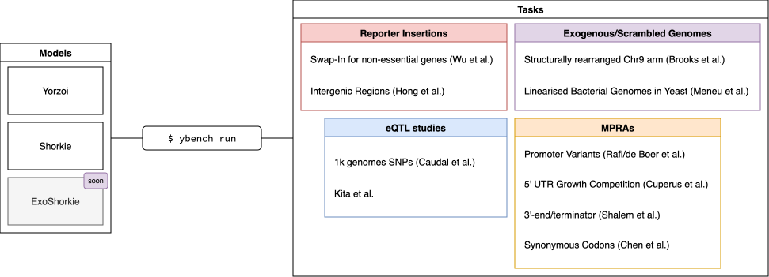

# ybench: a benchmark for fungal sequence-to-expression models



`ybench` is a comprehensive set of ten tasks to benchmark yeast-focussed sequence-to-function (S2F) models like Shorkie and Yorzoi. Each task covers a different part of the genomes regulatory complexity from eQTLs, promoter/UTR/terminator [MPRAs](https://www.google.com/search?q=mpra+massively+parallel+reporter+assay), reporter gene insertions in different genomic locations to investigate context effects as well as exogenous but linearised bacterial DNA in yeast and structurally rearranged chromosomes.

## Table of Contents

- [Benchmark Tasks](#benchmark-tasks)
- [Models](#models)
- [Results](#results)
- [Quickstart](#quickstart)
- [Architecture](#architecture)
- [Roadmap](#roadmap)
- [Contact](#contact)

## Benchmark Tasks

Please find a more comprehensive overview in [docs/benchmarks/](docs/benchmarks).

| Benchmark | Description | Task | Primary metric |
| --- | --- | --- | --- |
| [Caudal eQTL](docs/benchmarks/caudal_eqtl.md) | single-nucleotide *cis*-eQTLs vs matched controls | binary classification | AUROC / AUPRC (mean ± SEM over 4 negative sets) |
| [Kita eQTL](docs/benchmarks/kita_eqtl.md) | single-nucleotide *cis*-eQTLs (independent panel) | binary classification | AUROC / AUPRC |
| [Rafi / deBoer MPRA (promoter)](docs/benchmarks/rafi_mpra_promoter.md) | ~71k random 80 bp promoters in a dual-reporter plasmid GPRA | regression (marginalized logSED) | Pearson / Spearman |
| [Shalem MPRA (terminator)](docs/benchmarks/shalem_mpra_terminator.md) | designed 3′-end / terminator variants (cleavage & termination) | regression (marginalized logSED) | Pearson *r* (Spearman alongside) |
| [Chen synonymous MPRA](docs/benchmarks/chen_synonymous.md) | synonymous-codon effect on mRNA abundance | regression, 3 libraries | Pearson *r* + Spearman ρ on `log2(R/D)` | 
| [Wu RFP insertions](docs/benchmarks/wu_rfpins.md) | fixed RFP cassette across ORF-deletion loci (position effect) | regression | Pearson *r* + Spearman ρ (+ tail AUROC) | 
| [Hong IGR insertions](docs/benchmarks/hong_igr.md) | fixed reporter across intergenic loci (position effect) | regression | Spearman ρ on IntProp | 
| [Brooks SCRaMBLE](docs/benchmarks/brooks_scramble.md) | SCRaMBLE rearrangement (altered neighbour / downstream context) | coverage-track LFC | direction balanced accuracy, then Spearman / Pearson | 
| [Cuperus 5′-UTR](docs/benchmarks/cuperus_mpra_5utr.md) | random 50 bp 5′-UTRs (Kozak, uORFs, structure) | regression (HIS3 reporter) | Spearman/Pearson + partial-corr over Kozak features | 
| [Meneu foreign DNA](docs/benchmarks/meneu_foreign_dna.md) | whole bacterial chromosomes integrated in yeast (far-OOD sequence) | zero-shot coverage-track prediction | per-window Pearson + JS divergence (+ fold-change error) |

## Models

| Model | Description | Paper | Status |
| --- | --- | --- | --- |
| Shorkie | Language model based S2F model | [Predicting dynamic expression patterns in budding yeast with a fungal DNA language model](https://www.biorxiv.org/content/10.1101/2025.09.19.677475v1) | done |
| Yorzoi | Borzoi-based S2F model | [Yorzoi: Predicting RNA-seq coverage from DNA sequence in yeast](https://www.biorxiv.org/content/10.1101/2025.09.20.677345v1) | done |
| ExoShorkie | Shorkie finetuned on exo. genomes | [ExoShorkie: Predicting RNA-seq coverage of exogenous genomes in yeast by transfer learning](https://www.biorxiv.org/content/10.64898/2026.01.25.701486v1) | in progress |

## Results

Winner on each benchmark's primary metric (full per-metric tables in
[docs/results.md](docs/results.md)). These are from the latest local run; a full
rerun is pending and will refresh the numbers.

| Benchmark | Winner | Headline (winner vs. runner-up) |
| --- | --- | --- |
| [Caudal eQTL](docs/benchmarks/caudal_eqtl.md) | **Shorkie** | \|score\| AUROC 0.567 vs 0.530 |
| [Kita eQTL](docs/benchmarks/kita_eqtl.md) | _pending_ | only Yorzoi has run so far |
| [Rafi / deBoer MPRA (promoter)](docs/benchmarks/rafi_mpra_promoter.md) | **Shorkie** | Pearson r 0.76 vs 0.61 (DREAM-RNN baseline pending) |
| [Shalem MPRA (terminator)](docs/benchmarks/shalem_mpra_terminator.md) | **Yorzoi** | Pearson r 0.71 vs 0.64 |
| [Chen synonymous MPRA](docs/benchmarks/chen_synonymous.md) | **Mixed** | Shorkie on GFP, CAI on TDH3 |
| [Wu RFP insertions](docs/benchmarks/wu_rfpins.md) | **Neither** | both ≈ 0 — position effect not captured |
| [Hong IGR insertions](docs/benchmarks/hong_igr.md) | **Neither** | both ≈ 0 |
| [Brooks SCRaMBLE](docs/benchmarks/brooks_scramble.md) | **Yorzoi** | shape r 0.83 vs 0.42; LFC dir-acc 0.63 vs 0.52 |
| [Cuperus 5′-UTR](docs/benchmarks/cuperus_mpra_5utr.md) | **Shorkie** | random Spearman ρ 0.25 vs 0.12 |
| [Meneu foreign DNA](docs/benchmarks/meneu_foreign_dna.md) | **Yorzoi** | shape r 0.38 vs 0.26 (_M. mycoides_) |

## Quickstart

Install the framework with every model's dependencies, fetch the data, then run
the canonical `configs/default.yaml`:

```bash
uv sync --extra all                                   # framework + all models + data backend
uv run ybench data get --config configs/default.yaml  # download data + weights
uv run ybench run --config configs/default.yaml       # score every (model, task) pair
```

Results land in `results/default/<model>__<task>/`. For everything else — the
other models, partial data pulls, GPU selection, every flag, and the output
layout — see the [CLI reference](docs/cli.md).

## Architecture

Models and benchmarks don't import each other. They connect through small
**protocol** interfaces: a benchmark says which method it needs a model to
provide, and each model provides that method separately.

- A **benchmark** (one per task, in `src/yeastbench/benchmarks/`) declares the
  single protocol it needs, then implements `evaluate` / `plot` /
  `save_results`. It never refers to a specific model.
- A **protocol** (`src/yeastbench/adapters/protocols.py`) is a one-method
  interface for a capability a task needs — e.g. `score_variants` (eQTLs),
  `predict_expression_scores` (MPRAs), `predict_coverage_batch` (RNA-seq tracks).
- An **adapter** (`src/yeastbench/adapters/`) implements one protocol for one
  model by wrapping its forward pass. It never refers to a specific task.
- A **registry** (`src/yeastbench/registry.py`) maps names to tasks and models,
  and the `ybench` CLI connects them:

  ```
  task    = TASKS[task_name](...)               # e.g. caudal_eqtl
  adapter = MODELS[model_name](task, device)    # the model's adapter for task's protocol
  task.evaluate(adapter) → save_results → plot
  ```

Because tasks and models only depend on the protocol in between, adding a model
means writing one adapter per protocol it supports — not one per task. And a new
task that reuses an existing protocol needs no model changes at all. See
[docs/extending.md](docs/extending.md) for the step-by-step.

## Roadmap

See [`docs/ROADMAP.md`](docs/ROADMAP.md).

## Contact

> [!NOTE]
> In case of any questions, reach out to mail@timonschneider.de — always happy to help!

