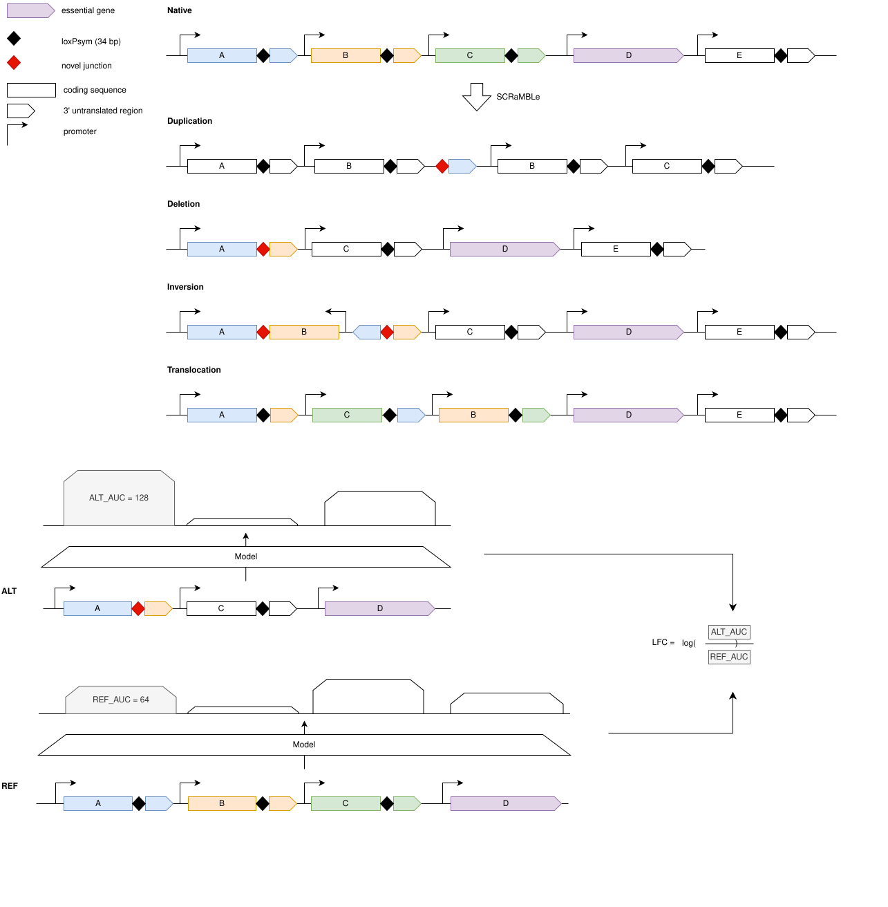
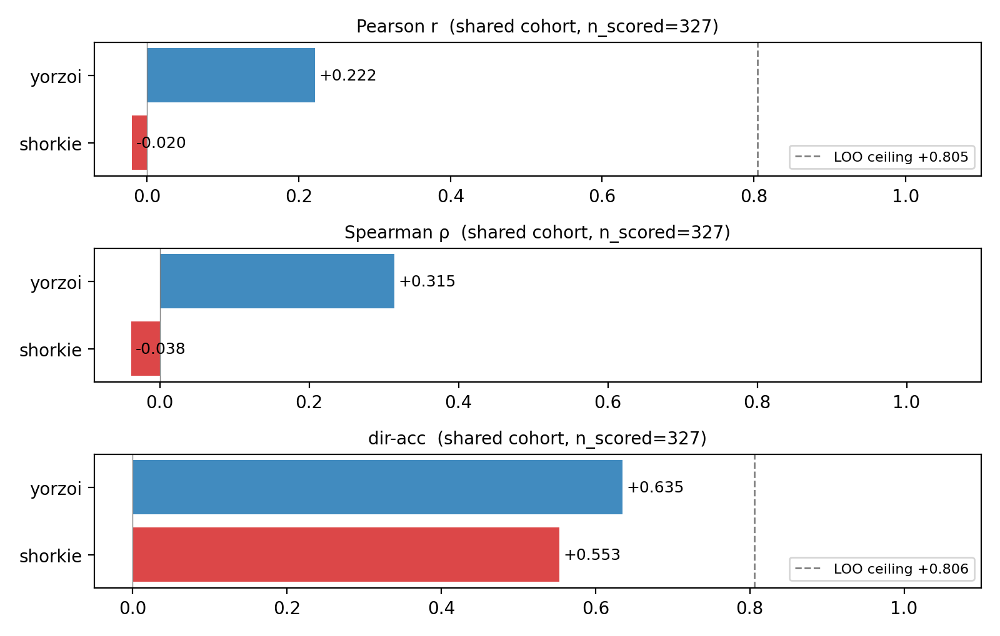
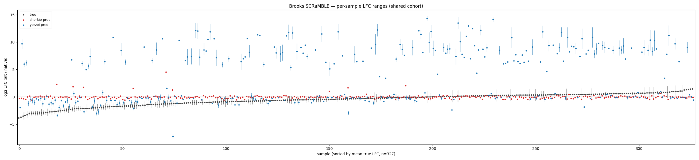

# Brooks et al. — SCRaMBLE structural-rearrangement expression effect



## At a glance

| | |
| --- | --- |
| **Task** | Predict how a SCRaMBLE structural rearrangement changes a synIXR gene's expression, from sequence. Two equally-weighted metric families: (1) scalar log-fold-change of CDS coverage (rearranged vs unscrambled control); (2, Yorzoi-only) the predicted coverage *profile* over the gene window. |
| **Source** | Brooks *et al.* 2022, *Transcriptional neighborhoods regulate transcript isoform lengths and expression levels*, Science 375(6584). DOI: [10.1126/science.abg0162](https://doi.org/10.1126/science.abg0162). Paper screenshots in `archive/brooks/`. |
| **Data** | `gs://brooks-nanopore/` — per-strain genome FASTA (`genomes/`), per-strain GFF (`annotations/`), per-strain Nanopore direct-RNA read alignments (`alignment/*.bed`). |
| **Assay** | Synthetic chr IX right arm (synIXR, ~91 kb, 43 loxPsym segments; loxPsym sits 3 bp after the stop codon of every nonessential CDS). Cre induces deletions / duplications / inversions / translocations. A rearranged CDS **keeps its native promoter but is decoupled from its native 3′UTR/downstream** — so the cis-predictable effect is principally the *new downstream context*. Long-read Oxford Nanopore **direct RNA-seq** per strain. |
| **Control** | **JS94** = parental −SCRaMBLE strain (synIXR, no induced recombination). Same genetic background; the only valid "before" for the rearrangement effect (not BY4741, which has native chr IX). |
| **Eval set** | One **(gene × strain × copy)** sample — see *Per-copy sampling*. ~58 SCRaMBLE strains available (not the Yorzoi-paper 5); sample set defined by an objective locked rule, not hand-picked. |
| **Primary metric** | LFC: **direction balanced accuracy** of sign(LFC), then Spearman ρ, then Pearson r, all on (pred, true) LFC across samples, read against the JS94 reproducibility ceiling. |
| **Adapter protocol** | New `CoverageTrackPredictor.predict_coverage(construct_seq, strand) -> np.ndarray` (per-bin window coverage). The benchmark derives the LFC CDS scalar and the shape profile from it. |

## Contents

- [At a glance](#at-a-glance)
- [Why this benchmark exists](#why-this-benchmark-exists)
- [Results](#results)
- [The data (verified from `gs://brooks-nanopore`)](#the-data-verified-from-gsbrooks-nanopore)
- [Confounds and how each is handled](#confounds-and-how-each-is-handled)
- [Per-copy sampling (the dosage solution)](#per-copy-sampling-the-dosage-solution)
- [Sample-set definition (objective, locked)](#sample-set-definition-objective-locked)
- [Constructs](#constructs)
- [Evaluation protocol](#evaluation-protocol)
- [Model contract](#model-contract)
- [Files](#files)
- [Open questions / future work](#open-questions--future-work)

## Why this benchmark exists

Every other benchmark perturbs *local* cis-sequence. SCRaMBLE perturbs
**genome architecture** while leaving each gene's CDS and promoter
intact, moving it next to new neighbours / new downstream termination.
It is the genome-scale companion to the Wu position-effect benchmark
(Wu: constant cassette, moving locus; Brooks: constant gene, rearranged
chromosome). The paper's own Fig. 4 GBRT is the key prior: a model with
**measured transcriptional-neighbourhood** features predicts Δexpression
far better than a **sequence-only** model. A cis sequence-to-expression
model is, in effect, the sequence-only regime — so this benchmark
measures the **cis-predictable fraction** of rearrangement-induced
expression change. That ceiling is intrinsic and is reported explicitly
(below), not hidden.

## Results

*2026-05-28 run. **These numbers predate the refactor:** they were produced from the pre-unification single-TSV inputs with `tier1_*`/`tier2_*` keys and two separate task registrations, before the `lfc_*`/`shape_*` rename and the 3-file artifact. The shared-cohort intersection (n = 327 scored) is the apples-to-apples comparison and should survive a re-run.*

| LFC, shared cohort (n = 327 scored) | Shorkie | Yorzoi | reproducibility ceiling |
| --- | ---: | ---: | ---: |
| direction balanced accuracy | 0.553 | 0.635 | 0.806 |
| Pearson r | −0.020 | 0.221 | 0.805 |
| Spearman ρ | −0.038 | 0.313 | — |

Coverage-shape (per-model full set): Yorzoi Pearson 0.835 / JS divergence 0.067; Shorkie 0.424 / 0.353 (on its T0 RNA-seq proxy track, not Nanopore).




- Yorzoi recovers a real but modest slice of the cis-predictable LFC (dir-acc 0.635, r 0.221) against an 0.806 / 0.805 reproducibility ceiling, and is strong on coverage shape (Pearson 0.835).
- Shorkie sits at zero on LFC because its adapter scores with `varies_by_strain=False` — one prediction per construct, so the rearrangement is invisible to it. Its magnitude is better-calibrated (mean |z| 2.0 vs Yorzoi's 11.2), but that is calibration, not ranking.

Why the numbers look the way they do: [`model_failures.md`](model_failures.md). Artifacts: `results/brooks/compare/per_task/brooks_scramble/summary.json` (shared cohort) and `results/brooks/{shorkie,yorzoi}__*/summary.json`.

## The data (verified from `gs://brooks-nanopore`)

- **Per-strain assemblies, no junction-walking needed.** Every strain's
  genome = the *byte-identical* native genome (`chrI–chrXVI`, `chrIXL`;
  identical contig sizes in every strain) **plus one synthetic contig**
  `JS<strain>_1` = its SCRaMBLEd synIXR. `JS94_1` = 98,752 bp
  (unrearranged parental); e.g. `JS606_1` = 165,327 bp (larger →
  duplications). The rearranged construct is just the focal copy's
  window in `JS<S>_1`; the native construct is the same gene in
  `JS94_1`. Table S3 junctions are needed only to *classify*
  rearrangement type — junctions are otherwise derivable by diffing
  `JS<S>_1` against `JS94_1`.
- **Per-strain GFF** annotates each synIXR gene with SGD ID,
  `essential_status`, `orf_classification`, and synthetic features.
- **Alignments** are per-strain read BEDs
  (`*_porechopped_filtered_canuCorrected_distinguished.bed`):
  `chrom start end read_id MAPQ strand`. MAPQ on `JS<n>_1` is
  ≈ all 60, **no MAPQ-0 multimappers** — "distinguished" keeps
  uniquely-assignable reads, so per-copy coverage by coordinate
  interval is well-defined.
- **Control sequence from JS96.** The bucket has **no `JS94` FASTA**
  (only `.fai`/`.genome`). `JS96_1` is the parental synIXR: identical
  98,752 bp and byte-identical synIXR GFF coordinates to `JS94_1` (a
  rearrangement would change these). → JS96 supplies the parental
  *sequence*; JS94 runs supply the parental *expression* (shared
  coordinate system).
- **Replicates / run-depth filter.** `JS94` has 8 BED runs, but 3 are
  **rrp6Δ/xrn1Δ RNA-decay-mutant** libraries (`…_20191017rrp6/xrn1/
  xrn1nc`) — *not* −SCRaMBLE WT and excluded by the strict run pattern.
  Of the 5 WT runs, 2 are failed/ultra-shallow (651 and 3,874 reads);
  a per-run native-library floor (`MIN_RUN_READS`, 50 k) drops them,
  leaving **3 deep WT JS94 runs** (2018-02-14 / 06-28 / 12-03) for the
  denominator and the reproducibility ceiling. Same depth filter applied
  to every SCRaMBLE strain's runs.
- **ERCC92** is in the genome FASTAs but **0 ERCC reads survive in the
  processed BEDs** → spike-in normalisation is unavailable; the
  native-genome size factor (below) is the correct tool regardless.

## Confounds and how each is handled

The core design question. Raw `cov(SCRaMBLE)/cov(JS94)` is dominated by
artefacts; the design neutralises each:

| Confound | Reality in this data | Handling |
| --- | --- | --- |
| **Library depth + sequencing batch** | JS94 ≈ 0.30 M reads (2018); JS606 ≈ 1.43 M (2019). ~5× depth + a year-apart batch. | The native genome is **genetically identical in every strain** → a **total-native-reads size factor** (reads on `chrI–chrXVI` minus synIXR, plus `chrIXL`; `chrMT` and the synthetic contig excluded) per strain/run, relative to the JS94-deep-run mean. Simple, robust, no per-gene modelling — matches the portability goal. (DESeq median-of-ratios is a documented v2 refinement.) |
| **Failed / wrong-condition runs** | `JS94` mixes in rrp6Δ/xrn1Δ decay-mutant libraries and 2 failed WT runs (651 / 3,874 reads). | Strict run pattern excludes the tagged decay-mutant libraries; `MIN_RUN_READS` floor drops failed/ultra-shallow runs (control *and* strain) before they corrupt the denominator/size-factor/ceiling. |
| **Technical noise / sparsity** | Nanopore direct-RNA is sparse on the small synIXR contig; many genes get <10 reads. | Per-sample `low_support` flag (CDS reads `< MIN_READS` in strain or JS94-mean); benchmark can restrict to well-supported samples. Mean of the **3 deep JS94 runs** for a stable denominator; the per-run JS94 normalised coverages are stored in the distribution so the **control–control reproducibility ceiling** is derivable and every model number is read against it (a model cannot beat the assay's own test–retest). |
| **Trans / neighbourhood transcription** | Paper Fig. 4: measured neighbourhood transcription, not sequence, dominates Δexpr. | Not removable — an intrinsic ceiling. Mitigate by restricting to genes whose **cis context changes within the model's receptive field** (the loxPsym-after-stop design puts the cis effect in the *new downstream junction*). Frame the metric as the cis-predictable fraction and report it against the reproducibility ceiling, never against 1.0. |
| **Copy-number / dosage** | Duplications/deletions change dosage; one window can't encode it. | **Dissolved by per-copy sampling** (next section): each copy is its own single-copy sample with its own downstream junction; no dosage term. |
| **Deletions** | Gene absent in strain → no CDS to centre a window on; "expression≈0 because deleted" is trivially predictable. | **Excluded** from the predictive set (optional separate sanity check, not the benchmark). |
| **Training-data leakage (Yorzoi)** | Yorzoi's training data *could* overlap the Brooks SCRaMBLEd sequences (Yorzoi trained on yeast RNA-seq incl. Brooks-derived data). | **Working assumption (user, 2026-05-19): Yorzoi was *not* trained on any Brooks SCRaMBLEd sequences** → treated as zero-shot for Yorzoi; no held-out filtering applied in v1. Kept here as an explicit, revisitable assumption rather than erased: if Yorzoi's training manifest later shows SCRaMBLEd-sequence overlap, the headline must be recomputed on the held-out subset (the Yorzoi maintainer can supply that list). Shorkie was not trained on Brooks regardless. |
| **Selection bias** | Yorzoi paper hand-picked 18 genes / 41 samples. | Replaced by an **objective locked rule** (below); reproducible, larger n, less bias. |

## Per-copy sampling (the dosage solution)

Because loxPsym sits 3 bp past the stop, **every rearrangement junction
gives the upstream gene a new downstream context** — duplicate copies of
a gene are virtually always *context-distinct*, not identical-dosage
duplicates. Reads are uniquely placed (MAPQ ≈ 60) and each copy occupies
distinct coordinates on `JS<S>_1`, so per-copy coverage is computable by
interval:

- `true LFC` for a copy = `log2( norm_cov(this copy's CDS, strain) /
  norm_cov(the gene's single CDS, JS94) )`.
- The model predicts that one copy's window (its specific downstream
  junction). Two copies of a gene → two independent cis samples.

Guardrails: require unique mapping + minimum per-copy read support; drop
the rare case where two copies are byte-identical within the receptive
field (not separable, not a distinct cis question).

## Sample-set definition (objective, locked)

A `(gene, strain, copy)` is an evaluated sample iff, in that strain's
assembly/GFF:

1. the copy has an **intact CDS** and retains its **native promoter**;
2. its **downstream context within ± the model receptive field differs
   from JS94** (a new junction inside the window — i.e. the cis input
   actually changed);
3. it is **uniquely mappable** and has **≥ (threshold) reads** in both
   the strain and JS94 (threshold pinned empirically — open question);
4. not byte-identical to another retained copy within the window;
5. **deletions excluded**.

**Window-agnostic, self-contained artifact.** The build script (run once,
needs the bucket) resolves every `(gene, strain, copy)` candidate and bakes a
**three-file** artifact under `data/tasks/brooks_scramble/`:
`brooks_index.tsv` (one row per construct: ids/strand/class, the **absolute**
alt + native coords and provenance — source genome / contig / slice offset —
`true_lfc`, the per-run JS94 replicate normalised CDS coverages so the
reproducibility ceiling is derivable, strain/JS94 read counts, native-genome
size factors), `brooks_constructs.fasta` (a generous gene-centred slice of alt
+ native sequence, ±FLANK bp), and `brooks_cov.npz` (the matching per-base
coverage). At eval time the benchmark re-cuts each construct to the model's
receptive field (`window_slice`) and re-applies the window-dependent membership
(alt + native fit, `alt != native`, dedup byte-identical copies per gene). It
depends on **these files alone** — no GCS, no per-strain genomes/GFF/BED, no
R64 reference. One artifact serves any model with window ≤ FLANK (16384).

## Constructs

- **Alt (rearranged), primary:** model-window from `JS<S>_1`, **gene
  centred** on the focal copy's CDS, carrying its specific downstream
  junction and as much native flank as the window holds.
- **Native (baseline):** the same gene **centred** in `JS94_1`
  (parental −SCRaMBLE synIXR).
- Window length per model (Yorzoi 4992 bp); gene-centred so up- and
  downstream context are balanced (CDS itself is short; the informative
  variation is at TSS/TES and the new junction, *outside* the CDS — see
  the shape-metric domain below).

## Evaluation protocol

### LFC — scalar effect size (Yorzoi primary; Shorkie via T0 RNA-seq proxy track)

1. Per sample: `pred_LFC = log2( Σ_pred(alt CDS bins) / Σ_pred(native
   CDS bins) )`; `true_LFC` from native-normalised Nanopore CDS coverage
   (per-copy), gene strand.
2. Metrics, in order: **(1) direction balanced accuracy** —
   `sign(pred_LFC)` vs `sign(true_LFC)`; **(2) Spearman ρ**;
   **(3) Pearson r** — across all samples.
3. Plot: predicted-vs-true LFC scatter, sign quadrants shaded, the
   **JS94×3 reproducibility band** overlaid, r/ρ/acc annotated; plus a
   per-rearrangement-class breakdown.

### Shape — coverage profile (Yorzoi-only)

Over the **full gene-centred window** (not CDS-only — the CDS profile is
usually flat; the signal is at TSS/TES/junction), at Yorzoi bin
resolution, strand-matched, on the **alt** construct (native as a sanity
baseline):

- **Pearson correlation** of predicted vs true binned coverage vectors
  (sensitive to peak co-location).
- **Jensen–Shannon divergence** as the **headline shape metric** —
  symmetric, bounded `[0, log2]`, finite without smoothing (each side
  compared to the mixture `M=½(P+Q)`, so the hard zeros in sparse
  Nanopore coverage cannot blow it up), and therefore comparable and
  averageable across samples of different depth. Computed on
  sum-1-normalised coverage vectors.
- **KL divergence** `D_KL(true‖pred)` (ε-smoothed) reported only as a
  *secondary* directional view ("model misses real signal"); not the
  headline because it is asymmetric, unbounded, undefined on zeros, and
  not comparable across samples. (`JSD = ½D_KL(P‖M)+½D_KL(Q‖M)`,
  `M=½(P+Q)`.) Both metrics ignore magnitude (the LFC metrics carry
  that); Pearson and JS are complementary — peak co-location vs
  mass-placement.

Report shape metrics against the **JS94×3 control–control** Pearson/JS
ceiling. Example loci plotted (true vs predicted profile, alt and native
overlaid), as in the Yorzoi Wu dump notebook.

### Reference baseline

Yorzoi paper: r = 0.33, ρ = 0.32, balanced accuracy = 0.62. Our sample
set is the objective rule (not the paper's hand-picked 41), so these are
**orientation only, not a direct comparison target**; the headline is the
result vs the reproducibility ceiling.

## Model contract

```python
class CoverageTrackPredictor(Protocol):
    def predict_coverage(self, construct_seq: str, strand: str) -> np.ndarray:
        """Per-bin predicted RNA-seq-like coverage over the input window,
        on `strand` (RC/strand-track conventions reuse the established
        Yorzoi machinery)."""
```

The benchmark builds the gene-centred alt and native window strings and
the in-window CDS interval; calls `predict_coverage` for each; forms the
CDS-sum LFC and the full-window shape. Shorkie can't do the shape metric
against Nanopore truth, so it runs LFC on a **T0 RNA-seq proxy track**
(mean of the 384 unstranded T0 RNA-seq coverage tracks). This ran and
scored — n = 528 on the full set, 327 on the shared cohort. But its
adapter is `varies_by_strain=False`: one prediction per construct,
broadcast across the strain axis, so the rearrangement signal is
invisible to it and its LFC sits at ~0 (the headline finding).

## Files

### Raw upstream (build-time only)
- `gs://brooks-nanopore/{genomes,annotations,alignment}/`.
- `archive/brooks/Screenshot *.png` — paper figures/methods.
- `scripts/brooks/build_brooks_distribution.py` — one-time builder
  (the *only* component that touches the bucket): JS96 parental
  sequence + JS94 deep-WT runs, run-depth filter, total-native-reads
  size factor, locked per-copy sample rule, gene-centred alt/native
  constructs, `true_lfc` + per-run JS94 coverages → the single file.

### Processed distribution (the sole run-time dependency)
Window-agnostic three-file artifact under `data/tasks/brooks_scramble/`, all
**built**, the benchmark reads nothing else (no GCS, no genomes, no R64):
- `brooks_index.tsv` — one row per `(gene, strain, copy)` candidate: ids/strand/
  `rearr_class`/`n_copies`, the absolute alt + native coords and provenance
  (`*_source_genome`, `*_contig`, `*_contig_len`, `*_cds_start/end`,
  `*_slice_start`), `true_lfc`, `norm_cov_js94_runs` (→ ceiling derivable),
  read counts, size factor, `low_support`.
- `brooks_constructs.fasta` — `alt~<sample_id>` / `native~<gene_id>` generous
  gene-centred slices (±FLANK = 16384 bp, clamped to the contig; native deduped
  per gene).
- `brooks_cov.npz` — per-base int32 coverage, same record keys.

The benchmark re-cuts each construct to the adapter's receptive field at run
time and re-applies the per-window membership/dedup (bit-identical to the old
4992 / 16384 TSVs: 698 / 1055 constructs). Full panel built with `--strains all`
(~56 strains → 1786 candidate constructs).

## Open questions / future work

1. **Thresholds** — `MIN_RUN_READS`=50 k and `MIN_READS`=10 set
   pragmatically; pin empirically from the JS94 deep-run noise floor
   (the count at which control–control LFC variance is acceptable).
1a. **JS707 → 0 samples** — its single run passed depth but no gene met
   "present in JS94 + alt window ≠ native within ±2496 bp". Check
   whether the rule is too strict (e.g. junction just outside the
   gene-centred window) before scaling.
1b. **Scale to `--strains all`** — v1 built on 4 strains (37 samples);
   the objective rule over the full ~58-strain panel is the real n.
   Heavier download/compute; run before locking the headline.
1c. **Median-of-ratios size factor** — total-native-reads is the v1
   normaliser (simple/portable); MoR over native genes is a documented
   v2 refinement if a global trans shift is observed.
2. **Shorkie LFC on the T0 proxy track** — implemented and ran (n = 528
   full / 327 shared). It scores ~0 because the adapter is
   `varies_by_strain=False`; the open question is whether a
   strain-varying Shorkie path is worth building.
3. **Rearrangement-type classification** — derive from `JS<S>_1` vs
   `JS94_1` diff; cross-check against Table S3 if obtainable (not in the
   bucket).
4. **Antisense / both-strand coverage** — the paper uses both-strand
   cosine similarity for neighbourhood. v1 is gene-strand only; revisit
   adding the antisense channel to the shape metric as a v2 extension.
5. **Receptive-field window length** — Yorzoi 4992 bp; confirm the
   gene-centred placement keeps the relevant new junction in-window for
   the bulk of samples (drop / flag those where it doesn't).
6. **JS94 run handling** — mean of the 3 runs vs per-run pairing for the
   denominator and the ceiling; pin in the build script.
