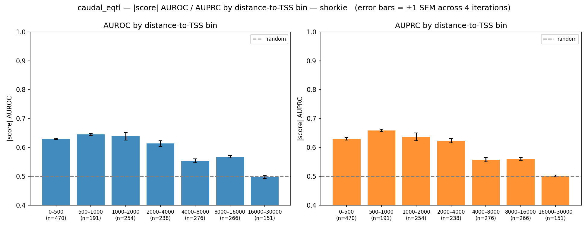
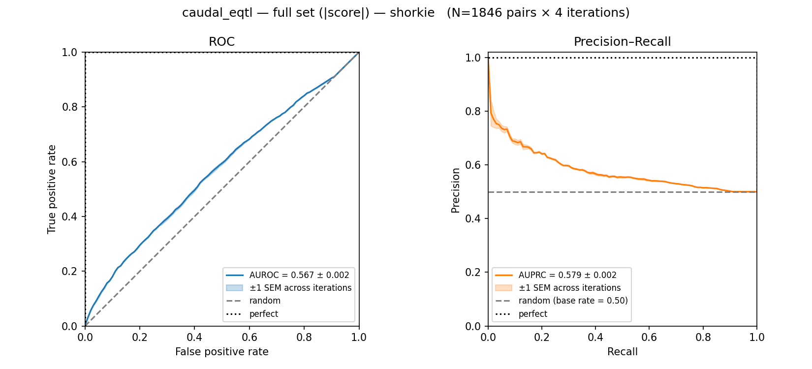

# Caudal et al. — yeast cis-eQTL classification


## At a glance

| | |
| --- | --- |
| **Task** | Binary classification: is this `(variant, gene)` pair a cis-eQTL, or a distance-matched non-eQTL control? |
| **Source** | Caudal et al. (TODO: full citation + DOI). GWAS summary statistics: `GWAS_combined_lgcCorr_ldPruned_noBonferroni_20221207.tab`, downloaded from the [1002 Yeast Genome Project](http://1002genomes.u-strasbg.fr/files/RNAseq). |
| **Assay** | cis-eQTL mapping (expression QTLs called across the 1011-isolate panel). |
| **Reference assembly** | *S. cerevisiae* R64-1-1, Ensembl release 115 (`Saccharomyces_cerevisiae.R64-1-1.115.gtf`) |
| **Eval set** | N = 1,846 paired rows per set × 4 negative sets (1,901 positives − 55 with no matchable negative); close-only subset (≤ 2 kb) N = 915. |
| **Background population for negatives** | 1011 yeast isolates panel (`1011Matrix.gvcf`, [1002 Yeast Genome Project](http://1002genomes.u-strasbg.fr/files/)). |
| **Positives** | **1,901 single-nucleotide cis-eQTL `(variant, gene)` pairs** over **1,656 unique variant positions** (~245 variants are eQTLs for more than one gene). All 1,656 positions are observed in the 1011 panel, so the gVCF intersection drops 0 of 1,901 pairs. |
| **Negatives** | Common variants (AF ≥ 0.05) from the 1011 panel outside any annotated CDS/exon, REF/ALT-matched and distance-to-TSS-matched to the positive. Drawn genome-wide (see [Cross-chromosome negatives](#cross-chromosome-negatives)); four independent sets are generated and reported on. |
| **Primary metric** | AUROC and AUPRC (no class balancing), mean ± SEM over the 4 negative sets. |
| **Secondary metric** | Distance-to-TSS-stratified AUROC/AUPRC and a close-only (≤ 2 kb) subset for small-window models. |
| **Adapter protocol** | `VariantEffectScorer.score_variants` (`src/yeastbench/adapters/protocols.py`). |

## Contents

- [At a glance](#at-a-glance)
- [Results](#results)
- [Why this benchmark exists](#why-this-benchmark-exists)
- [Dataset construction](#dataset-construction)
- [Distribution](#distribution)
- [Model contract](#model-contract)
- [Evaluation protocol](#evaluation-protocol)
- [Running the benchmark](#running-the-benchmark)
- [Files](#files)
- [Open questions / future work](#open-questions--future-work)

## Results

*Zero-shot, 2026-06-13 run (v1). The classification score is `|logSED|` (absolute marginalized effect); AUROC/AUPRC are computed without class balancing and averaged over the 4 negative sets.*

| `|score|` metric (mean ± SEM, 4 negative sets) | Shorkie | Yorzoi |
| --- | ---: | ---: |
| AUROC, full set | 0.567 ± 0.002 | 0.530 ± 0.001 |
| AUPRC, full set (base rate 0.5) | 0.579 ± 0.002 | 0.536 ± 0.002 |
| zero-score fraction | 0.09 | 0.38 |





- Both models clear the 0.5 paired baseline, but only just; Shorkie edges Yorzoi on the full set.
- The signal is local: AUROC peaks at 0–1 kb from the TSS and falls to chance by 16–30 kb (above). On the close-only (≤ 2 kb) subset — the fair view for small-window models — Shorkie rises to ≈ 0.62.
- Most of the full-set gap is reach, not ranking: Yorzoi scores 0 on 38% of pairs (variant outside its ~4 kb window) versus Shorkie's 9%. The signed score barely ranks at all (AUROC ≈ 0.50); only `|logSED|` carries signal.

Why the numbers look the way they do: [`model_failures.md`](model_failures.md). Artifacts: `results/default/{shorkie,yorzoi}__caudal_eqtl/summary.json`.

## Why this benchmark exists

Caudal et al. is the largest publicly available set of statistically called
yeast cis-eQTLs (1,901 single-nucleotide `(variant, gene)` cis hits across
~1,000 isolates), with effect sizes and per-gene phenotype annotations.
Used as a binary classification task it asks: *given a variant and a
candidate target gene, can a sequence model rank true eQTLs above
distance-matched controls drawn from the same population?*

The benchmark's primary use is **comparing yeast sequence-to-expression
models against each other and against MPRA-trained baselines** under a
shared, simple task framing.

## Dataset construction

### Positive set
1. Start from `GWAS_combined_lgcCorr_ldPruned_noBonferroni_20221207.tab`
   (provided by Caudal et al., downloaded from the 1002 Yeast Genome
   Project). Despite the `.tab` extension the file is **comma-separated**;
   read it as CSV.
2. Drop rows where `ld_mask == "masked"` (LD-pruned-out variants). 49,670
   of the 59,140 raw rows are dropped here, leaving 9,470.
3. Restrict to `subtype == 'SNP'`. Copy-number variants are out of scope
   for v1 (see [Open questions](#open-questions--future-work)).
4. Restrict to **single-nucleotide cis-eQTLs**: variants on the same
   chromosome as the regulated gene's body and within 25 kb of it. The
   bounds are inclusive and use both ends of the gene `[Pheno_pos,
   Pheno_pos_end]`. Equivalent rule, expressed against the upstream
   column in the source file: `type == 'CIS'` (verified empirically — the
   upstream `type` column encodes exactly this rule, perfectly matching
   1,901 SNV `(variant, gene)` rows). The benchmark uses the cis set
   only; trans variants are not in scope.
5. Intersect with the 1011 panel gVCF on `(Chr, ChrPos)` to retain only
   variants that are observed segregating in the population. Empirically,
   **all 1,656 unique variant positions in the cis set are observed in
   the 1011 panel**, so this step drops 0 of 1,901 pairs. (The pipeline
   still performs the intersection so the same code path applies to
   future eQTL releases.)
6. Each retained row provides a `(chrom, pos, ref, alt, gene)` 5-tuple.
   The gene is the regulated phenotype the eQTL is called against
   (`Pheno` column). The same `(chrom, pos, ref, alt)` can appear in
   more than one row if the variant is an eQTL for more than one gene
   (245 such cases).

After step 4 the cis set contains exactly **1,901 `(variant, gene)`
pairs over 1,656 unique variant positions**. Step 5 leaves both counts
unchanged. Of these, **55 positives have no `(ref, alt)`-matched
variant anywhere in the 1011 panel** (genome-wide, not just same
chromosome) and cannot be paired with a negative; they are dropped from
every iteration. The remaining **N = 1,846 pairs** is the size of each
`negset_{i}.tsv`.

> **Note.** The "within 25 kb of the gene body" framing is the biological
> criterion; the `type == 'CIS' & subtype == 'SNP'` filter on the upstream
> file is the mechanical realization, and both produce the same 1,901
> pairs. The 1,901 is a `(variant, gene)` pair count, not a variant count:
> there are 1,656 unique positions, ~245 of which appear in two or more
> pairs. The benchmark scores at the pair level, so a variant that is a
> cis-eQTL for two genes is scored twice (against a different randomly
> drawn negative for each target gene).

### Negative set
Negatives are generated by `scripts/eqtl/0_data_generation/1_generate_negs.py`
run unmodified against the Caudal positive set. For each positive eQTL
`(chrom, pos, ref, alt, gene)`:

1. Compute distance from `pos` to the TSS of `gene` (parsed from the GTF).
2. Restrict candidate negatives to gVCF variants that fall **outside any
   annotated CDS or exon interval** in the Ensembl 115 GTF (intronic and
   intergenic eligible; UTRs that are part of annotated exons are
   excluded), with AF ≥ 0.05 and **identical (ref, alt)** alleles. The
   candidate pool is genome-wide; same chromosome as the positive is
   **not** a constraint.
3. Pick one candidate negative variant with matching `(ref, alt)`. Then,
   on the negative variant's **own** chromosome, pick a random gene
   whose TSS distance to the negative variant matches the positive's
   distance-to-TSS within ±100 bp tolerance (fallback ±200 bp). The
   randomly chosen gene becomes the negative variant's "target gene"
   (same-chromosome between variant and gene is required only so that
   distance-to-TSS is well-defined).
4. Reject candidates that match a known positive `(chrom, pos, ref, alt)`
   or that have already been used in the current negative-set iteration
   (de-dup key: `(chrom, pos, target_gene)`, so the same chromosomal
   position can pair with two different randomly-chosen target genes
   across pairs but not within one).
5. Repeat for `--iterations` independent negative sets (CLI default 4).

The output is a TSV per iteration with paired `(positive, negative)` rows
sharing distance-to-TSS, REF, and ALT.

#### Cross-chromosome negatives

The canonical `1_generate_negs.py` script does **not** require the
negative variant to live on the same chromosome as its paired positive.
The candidate pool is "all gVCF variants in the genome with the same
`(ref, alt)` as the positive"; same-chromosome is enforced only between
the *negative variant and its randomly chosen target gene* (required so
that distance-to-TSS is well-defined). In practice, ~7% of generated
pairs happen to be same-chromosome — consistent with uniform random
draws across the 16 yeast chromosomes.

**v1 does not add a same-chromosome post-filter.** Rationale:

- The scoring models (Shorkie, Yorzoi) take a DNA window and a target
  gene as input; chromosome identity is not a model input. A model
  therefore cannot learn "different chrom → negative" as a shortcut —
  it has no access to that signal.
- Matched `(ref, alt)` and matched distance-to-TSS already control for
  the mechanical features the model sees (which nucleotide change is
  being evaluated and how close to a TSS). Adding a same-chromosome
  filter does not block an additional cheat path we can construct.
- The published Shorkie Caudal numbers were produced by the unmodified
  script, so enforcing same-chromosome would deviate from the paper's
  evaluation without improving rigor.

**Properties of the matching scheme:**
- ✅ REF/ALT distribution is identical between positives and negatives.
- ✅ Distance-to-TSS distribution is matched within tolerance.
- ✅ Negatives have AF ≥ 0.05, so the model cannot trivially distinguish
  positives from rare/private variants.
- ℹ️ Negatives are drawn genome-wide; ~7% land on the same chromosome as
  their paired positive by chance.

## Distribution

The benchmark is split into two layers so that adding a new model does not
require running the upstream pipeline:

- **Raw upstream** — the original GWAS sumstats, the 1011 panel gVCF, and
  the Ensembl GTF. The 1011 gVCF and the reference FASTA/GTF live at
  `data/tasks/` (shared with Kita); Caudal-specific GWAS sumstats and
  pipeline intermediates live at `data/tasks/caudal_eqtl/`. The pipeline
  that turns them into benchmark-ready files lives in `scripts/eqtl/`.
- **Processed benchmark distribution** — four flat TSV files (one per
  negative-set iteration) at `data/tasks/caudal_eqtl/`. Hosted in a
  **GCP bucket** (`gs://yeast-seq2expression/caudal_eqtl_v1/`, exact URL
  pinned in the v1 release notes); reference FASTA + GTF are shared at
  `data/tasks/R64-1-1.{fa,115.gtf}`.

**Adapters consume the processed distribution.** The pipeline is
provided for provenance and reproducibility; it is not on the critical
path for adding a new model.

### Processed file layout

```
data/tasks/
├── R64-1-1.fa         # shared reference FASTA, indexed
├── R64-1-1.fa.fai
├── R64-1-1.115.gtf    # shared annotation
└── caudal_eqtl/
    ├── README.md      # version, generation date, source commit
    ├── negset_1.tsv   # 1,846 rows (one per pos/neg pair)
    ├── negset_2.tsv
    ├── negset_3.tsv
    └── negset_4.tsv
```

Each `negset_{i}.tsv` is the complete classification problem for that
iteration (1,846 paired rows). An adapter scores the positive and
negative half of every row; the harness computes per-iteration
AUROC/AUPRC over the union of all 3,692 scored variants and reports
mean ± SEM across iterations.

### Schema

**One row per `(positive, negative)` pair.** Each row encodes a positive
variant and the negative it was matched to in that iteration. The pair is
the unit of identification — the harness does the per-variant explosion
internally for AUROC/AUPRC.

| Column | Type | Required | Notes |
| --- | --- | --- | --- |
| `pair_id` | int | ✅ | Stable per-row identifier within a `negset_{i}.tsv` file. Not unique across files (the same pair index in negset_2 refers to a different randomly drawn negative). |
| `pos_chrom` | str | ✅ | Arabic-numeral form (`1`, `2`, …, `16`), no prefix. The pipeline normalizes the Caudal CSV (already integers), the 1011 gVCF (`chromosome{N}` form), and the Ensembl GTF (Roman-numeral form) to this canonical convention. |
| `pos_pos` | int | ✅ | 1-based, on R64-1-1. |
| `pos_ref` | str | ✅ | Reference allele. |
| `pos_alt` | str | ✅ | Alternate allele. |
| `pos_gene` | str | ✅ | Ensembl gene ID of the regulated target gene from the upstream Caudal release. |
| `pos_gene_strand` | str | ✅ | `+` or `−`, the target gene's strand from the GTF. Saves the adapter from a GTF lookup. |
| `pos_distance_to_tss` | int | ✅ | Unsigned bp distance from `pos_pos` to the target gene's TSS. |
| `neg_chrom` | str | ✅ | Same convention as `pos_chrom`. **May differ from `pos_chrom`** — negatives are drawn genome-wide (see [Cross-chromosome negatives](#cross-chromosome-negatives)). In practice ~7% of pairs are same-chromosome by chance. |
| `neg_pos` | int | ✅ | 1-based, on R64-1-1. |
| `neg_ref` | str | ✅ | Identical to `pos_ref` (REF/ALT-matching). |
| `neg_alt` | str | ✅ | Identical to `pos_alt`. |
| `neg_gene` | str | ✅ | Ensembl gene ID of the *randomly chosen* gene on **`neg_chrom`** (the negative variant's own chromosome) at the matched TSS distance. Not the negative variant's biological target. |
| `neg_gene_strand` | str | ✅ | `+` or `−`, from the GTF. |
| `neg_distance_to_tss` | int | ✅ | Unsigned bp distance from `neg_pos` to `neg_gene`'s TSS. By construction within ±100 bp (fallback ±200 bp) of `pos_distance_to_tss`. |

Conventions locked in for v1:
- **Chromosome naming**: Arabic numerals, no prefix (`1`, `2`, …, `16`).
  The pipeline normalizes the Caudal CSV's integer chromosomes (already
  in this form), the 1011 gVCF's `chromosome{N}` form, and the Ensembl
  GTF's Roman-numeral form to this canonical convention.
- **Coordinates**: 1-based, inclusive (matches the GTF and the source
  CSV's `ChrPos`).
- **Sort order**: rows sorted by `(pos_chrom, pos_pos)`.
- **`gene_strand` columns** are looked up from the Ensembl 115 GTF at
  processed-file generation time; the underlying negative-generation
  script does not carry strand.

### Example head

A few illustrative rows of `negset_1.tsv` (tab-separated; values are
schema-faithful but illustrative):

```
pair_id  pos_chrom  pos_pos  pos_ref  pos_alt  pos_gene  pos_gene_strand  pos_distance_to_tss  neg_chrom  neg_pos  neg_ref  neg_alt  neg_gene  neg_gene_strand  neg_distance_to_tss
0        1          33892    A        G        YAL048C   -                1217                 7          412583   A        G        YGR109C   -                1231
1        1          51077    C        T        YAL038W   +                542                  12         807142   C        T        YLR353W   +                619
2        1          68018    G        A        YAL026C   -                2944                 1          115203   G        A        YAL012W   +                2871
3        2          47813    T        C        YBL091C   -                3315                 4          1104882  T        C        YDR201W   +                3298
```

(Most pairs have `pos_chrom != neg_chrom` by construction of the
candidate filter — see [Cross-chromosome negatives](#cross-chromosome-negatives).
The row with `pair_id = 2` happens to be same-chromosome.)

### Versioning

The processed distribution is versioned (`caudal_eqtl_v1`, `_v2`, …). A
version bump is required whenever any of: the source upstream data, the
cis criterion, the negative-generation parameters, or the schema
changes. Adapters record which benchmark version they ran against in
their reported numbers.

## Model contract

A model is evaluated on this benchmark by exposing a Python adapter that
implements the `VariantEffectScorer` protocol:

```python
@dataclass(frozen=True)
class Variant:
    chrom: str     # '1'..'16'
    pos: int       # 1-based, R64-1-1
    ref: str
    alt: str
    gene_id: str   # Ensembl gene ID


class VariantEffectScorer(Protocol):
    def score_variants(self, variants: Sequence[Variant]) -> np.ndarray: ...
```

The benchmark loads `negset_{i}.tsv`, builds a `Variant` per positive and
negative, and calls `adapter.score_variants(variants)` once per iteration;
the adapter does window placement, ref-allele check, ref/alt one-hot,
predict, aggregate, and log-fold-change. See
[`architecture.md`](architecture.md) for the full Python interface sketch
(Protocol definitions, base classes, and harness entry point).

End-to-end usage from a caller's point of view:

```python
from pathlib import Path
from yeastbench.benchmarks.base import BenchmarkInfo
from yeastbench.benchmarks.eqtl import EQTLClassificationBenchmark
from yeastbench.adapters.shorkie_eqtl import (
    ShorkieVariantScorer,
    SHORKIE_1011_RNA_SEQ_TRACK_IDS,
)
from yeastbench.models.shorkie import Shorkie  # pure-PyTorch port
from yeastbench import harness

benchmark = EQTLClassificationBenchmark(
    distribution_dir=Path("data/tasks/caudal_eqtl"),
    fasta_path=Path("data/tasks/R64-1-1.fa"),
    gtf_path=Path("data/tasks/R64-1-1.115.gtf"),
    info=BenchmarkInfo(
        name="caudal_eqtl",
        version="v1",
        description="Caudal et al. yeast cis-eQTL classification",
        distribution_uri="gs://yeast-seq2expression/caudal_eqtl_v1/",
    ),
)
model = Shorkie.from_tf_checkpoint(config, "data/models/shorkie/checkpoints/f0.h5")
adapter = ShorkieVariantScorer(
    model,
    fasta_path="data/tasks/R64-1-1.fa",
    gtf_path="data/tasks/R64-1-1.115.gtf",
    track_subset=SHORKIE_1011_RNA_SEQ_TRACK_IDS,
)
harness.run(benchmark, adapter, out_dir=Path("results/shorkie/caudal"))
```

**What the adapter is responsible for:**
- Choosing the input window length and centering.
- Strand handling (see model-specific defaults below).
- Verifying the reference allele in the FASTA matches the `ref` field
  at `pos` and **failing loudly if not**.
- Choosing which output track(s) to read variant effect from (relevant
  for models that expose multiple expression-related tracks; see
  model-specific defaults below).
- Computing the ref-vs-alt comparison and reducing it to a scalar.
- Returning a finite scalar even when the variant is near a chromosome
  edge.

**Tracks and aggregation: only the aggregate is allowed.** A model with
multiple expression-related output tracks must aggregate them into a
single scalar via a *fixed* per-adapter rule documented at construction
time. Per-call track picking is not allowed. The Shorkie and Yorzoi
adapters below show the locked-in choices.

### Reference example: Shorkie's scoring function

The canonical Shorkie scoring procedure for this benchmark is:

1. **Position a 16,384 bp input window** so the variant lies inside the
   model input *and* the target gene's center lies inside the model's
   output slice (the model crops its output to a smaller centered
   region). When both constraints can be satisfied, the start position
   is the midpoint of the valid range, which means the variant ends up
   approximately — but not exactly — at the center of the input for
   typical Caudal positives where the variant is within a few kb of the
   gene. When the variant is too far from the gene's center for both
   constraints to fit, the window falls back to gene-centered, the
   variant lies **outside** the model input, and the alt sequence is
   identical to the ref sequence (variant effect score = 0). This
   matches the canonical upstream Shorkie scoring behavior. **This is
   not a rare edge case for the Caudal v1 set: 22% of positives sit
   beyond half the 16 kb input window from their gene's TSS** and are
   thus invisible to Shorkie's architecture — see
   [Open questions](#open-questions--future-work) for the implications.
2. Verify that the reference base at `pos` matches the `ref` field, and
   **raise on mismatch** — but only when the variant is inside the input
   window. For variants that fall outside the window (per the
   gene-centered fallback in step 1), the ref base is unobserved and
   no check is possible. (The upstream Shorkie scoring script logs a
   debug warning on mismatch and continues; our adapter must enforce
   strict verification when the check is meaningful.)
3. One-hot encode both the reference and the alternate sequences.
4. Predict expression coverage tracks for both with the **pure-PyTorch
   Shorkie port** at <https://github.com/tdsone/shorkie-pytorch>
   (currently vendored in `src/yeastbench/models/shorkie.py`). The
   benchmark **must not introduce a dependency on `SeqNN` or
   `baskerville`** — the upstream variant-scoring script
   (`scripts/eqtl/2_variant_scoring/score_variants_shorkie.py`) is
   provided as documentation only; its scoring logic is reimplemented
   on top of the PyTorch model. Predictions are ensemble-averaged
   across the 8 trained folds (`f0`–`f7`).
5. **Strand handling.** Shorkie predicts *stranded* RNA-seq tracks, so
   averaging both genome strands is only correct for unstranded
   protocols. The adapter sums coverage on the **single strand the
   target gene is annotated on** (sense strand, from `pos_gene_strand`
   / `neg_gene_strand`), not both strands.
6. **Track aggregation.** For the Caudal benchmark specifically,
   aggregate over **the 1,014 "1000-RNA-Seq" tracks** from the Shorkie
   canonical targets sheet (indices 4201..5214 inclusive). Other
   expression-related output tracks (IDEA induction RNA-seq, ChIP-exo,
   ChIP-MNase) are excluded. Aggregation form: cross-track mean of the
   selected tracks → sum over the bins overlapping the target gene's
   annotated exons → `log2(Cov_alt + 1) − log2(Cov_ref + 1)` (the
   `logSED_agg` form). The alternative `logSED_mean_pertrack` is
   intentionally not exposed.

   > **Count note.** The benchmark description informally calls these
   > "the 1011 RNA-seq tracks" (after the 1011 yeast-panel size); the
   > released targets sheet actually contains 1,014 tracks under the
   > `1000-RNA-Seq` group. We pin to the released file.

7. **Reverse-complement averaging.** Required for both `ref` and `alt`
   passes. For each fold, predict on the input and on its
   reverse-complement, flip the RC prediction along the bin axis, and
   average. Shorkie's 1011 RNA-seq tracks are unstranded coverage
   (1 track per sample), so no track-index swap is needed — only the
   bin-axis flip. Empirically reduces noise in the magnitude score and
   gains ~0.01–0.015 AUROC / AUPRC on the close-only subset.

8. **Signed measurement → unsigned classification score.** `logSED_agg`
   is the signed per-variant measurement (effect direction + magnitude).
   The **classification score fed to AUROC/AUPRC is its absolute
   value** `|logSED_agg|`. Real eQTLs perturb expression in either
   direction, so the signed score is uninformative for binary
   "is-it-an-eQTL" classification; empirically, signed-AUROC sits at
   ~0.50 on the full set while `|score|` AUROC is ~0.57–0.63. The
   adapter returns the signed score (so downstream tooling can still
   inspect direction); the harness takes `abs()` when computing
   classification metrics.

### Reference example: Yorzoi's scoring function

Yorzoi uses a smaller architecture — **4,992 bp input, 162 output
tracks (81 forward + 81 reverse strand), 300 bins × 10 bp/bin**
covering the central 3,000 bp of input. The scoring pipeline mirrors
Shorkie's (steps 1–4, 7–8 apply with the Yorzoi geometry substituted
in) except for these adapter-level choices, locked for the run:

- **Strand handling.** **+ (forward) strand only** (tracks 0..80),
  regardless of the target gene's annotated strand.
- **Track aggregation.** **All 81 `+` strand tracks**. Aggregation
  form mirrors Shorkie's `logSED_agg` (cross-track mean → exon-bin sum
  → log2 fold change).
- **RC averaging.** Because Yorzoi's tracks are stranded, RC averaging
  requires a strand-swap on the RC pass in addition to the bin-axis
  flip: feeding `RC(X)` means the model's `+` output now predicts what
  was `X`'s `-` strand, and vice versa. For the `+-only` subset, we
  take indices 0..80 from the forward pass and indices 81..161 from
  the RC pass (then flip the bin axis), average, and proceed.

**Architectural implications for coverage.** Yorzoi's joint-feasibility
limit is |variant − gene_center| ≤ ~4 kb (vs Shorkie's ~15 kb); beyond
that the window falls back to gene-centered and the variant lies
outside the input, giving a score of 0. Empirically Yorzoi's
zero-score fraction on Caudal v1 is ~38% on the full set vs Shorkie's
~9%. The close-only subset below is the fair-comparison view.

## Evaluation protocol

For each of the four negative-set iterations `i ∈ {1..4}`:
1. Score every positive and every paired negative with the model.
   The adapter returns the signed `logSED_agg`; the harness takes
   `abs()` before ranking (see [Shorkie scoring](#reference-example-shorkies-scoring-function)
   step 8).
2. Compute AUROC and AUPRC over the union of positives and negatives in
   iteration `i`. **Do not subsample to balance classes** — the natural
   prevalence is informative.
3. Record per-iteration metrics for both the signed and absolute
   scores; report absolute as the primary number.

**Primary report:** mean ± SEM across the four iterations, plus the
per-iteration ROC and PR curves interpolated to a common grid and shown
with ±1 SEM bands. **The plots must include random and perfect
baselines:**

- **ROC**: random = diagonal `y = x`; perfect = step at `(0, 1)`.
- **PR**: random = horizontal line at the base rate (= 0.5 for the
  1:1 paired schema); perfect = step at `(1, 1)`.

This is a hard requirement of the benchmark, not a stylistic choice —
the AUROC/AUPRC numbers are uninterpretable in isolation, and the
baselines provide the only honest visual context for a given run.

**Standard secondary reports** (both required):

- **Distance-to-TSS stratification.** `|score|` AUROC and AUPRC
  stratified by `pos_distance_to_tss` bin. **Bins for v1:**
  `[(0, 500), (500, 1000), (1000, 2000), (2000, 4000), (4000, 8000),
  (8000, 16000), (16000, 30000)]`. Reported per bin, not just as a
  curve over cumulative-cutoff thresholds.
- **Close-only subset.** `|score|` AUROC and AUPRC on the subset where
  `pos_distance_to_tss ≤ 2000 bp`. **This is the fair-comparison view
  for models with small receptive windows** (notably Yorzoi at ~5 kb
  input / ~3 kb output, joint-feasibility limit ~4 kb from gene
  center). Without this subset, models with smaller windows are
  penalized for variants their architecture cannot in principle reach.
  The `≤ 2 kb` cap gives both Shorkie and Yorzoi a safety margin
  against edge-of-output-crop effects and makes cross-model
  comparisons meaningful. Revisit when a model with a smaller window
  is added.

The harness produces all three reports (primary + the two secondaries)
as PNG plots in the run output directory. Plotting is part of
`Benchmark.plot()` — never an optional post-step.

## Running the benchmark

The benchmark is invoked via the repo's unified CLI (`ybench`), driven
by a YAML run-spec that lists `(model, task)` pairs with per-run
settings. The committed `configs/default.yaml` is the canonical run —
the one whose numbers we report.

```bash
# List registered models and tasks
uv run ybench list

# Dry-run: show planned (model × task) pairs
uv run ybench run --config configs/default.yaml --dry-run

# Execute everything in the config
uv run ybench run --config configs/default.yaml

# Filter to a single model or task (any combination)
uv run ybench run --config configs/default.yaml --model shorkie
uv run ybench run --config configs/default.yaml --task  caudal_eqtl
```

### Output layout

One directory per `(model, task)` pair, under the config's `out_dir`:

```
results/default/
  shorkie__caudal_eqtl/
    negset_{1..4}_scores.npy   # per-iteration signed logSED_agg, shape (2N,)
    negset_{1..4}_labels.npy   # 1/0 alternating pos/neg, shape (2N,)
    negset_{1..4}_pairs.tsv    # pair-level metadata for post-hoc stratification
    summary.json               # per-iteration + aggregate AUROC/AUPRC (signed + |s|)
    run_metadata.json          # config hash, git commit, model + task config, timestamp
  yorzoi__caudal_eqtl/
    …
```

The `run_metadata.json` captures everything needed to reproduce that
directory's numbers: the config file hash, the git commit of the
repo, the resolved model/task configs, and the timestamp. Raw scores
+ labels + pair metadata are persisted so post-hoc analyses
(distance-stratified AUROC, signed-vs-absolute comparison, oracle
diff, etc.) don't require re-running the model.

### Adding a new model or task

- **Model:** add a factory to `MODELS` in `src/yeastbench/registry.py`
  with signature `(task, device, **model_config) -> VariantEffectScorer`.
  Then reference it by name in the YAML config.
- **Task:** add a factory to `TASKS` with signature
  `(**task_config) -> Benchmark`. Then reference it in the YAML.

No new `run_*.py` scripts; no new CLI wiring.

## Files

| Purpose | Path |
| --- | --- |
| Raw GWAS sumstats (Caudal) | `data/tasks/caudal_eqtl/GWAS_combined_lgcCorr_ldPruned_noBonferroni_20221207.tab.txt` ([source](http://1002genomes.u-strasbg.fr/files/RNAseq)) |
| Background gVCF (1011 panel) | `data/tasks/1011Matrix.gvcf.gz` ([source](http://1002genomes.u-strasbg.fr/files/), shared with Kita) |
| Reference GTF | `data/tasks/R64-1-1.115.gtf` |
| Reference FASTA | `data/tasks/R64-1-1.fa` |
| Processed benchmark distribution | `gs://yeast-seq2expression/caudal_eqtl_v1/` (GCP bucket; exact URL pinned in v1 release notes) |
| Negative-set generation | `scripts/eqtl/0_data_generation/1_generate_negs.py --dataset caudal` |
| Processed-distribution builder | `scripts/eqtl/build_caudal_v1_distribution.py` (raw TSV → spec schema; strand lookup from GTF; symlinks reference files) |
| Shorkie variant scoring (upstream reference, SeqNN-based) | `scripts/eqtl/2_variant_scoring/score_variants_shorkie.py` — provided as documentation only; the adapter reimplements this on top of `src/yeastbench/models/shorkie.py` (pure PyTorch). |
| Shorkie adapter | `src/yeastbench/adapters/shorkie_eqtl.py` |
| Yorzoi adapter | `src/yeastbench/adapters/yorzoi_eqtl.py` |
| Shared genome utilities (GTF parse, FASTA windowing, one-hot, exon-bin selection) | `src/yeastbench/adapters/_genome.py` |
| Model + task registry | `src/yeastbench/registry.py` |
| Canonical run config | [`configs/default.yaml`](../../configs/default.yaml) |
| CLI | `ybench` (`src/yeastbench/cli.py`), installed by `uv sync` |
| Architecture / API sketch | [`architecture.md`](architecture.md) |
| Evaluation / plots | `EQTLClassificationBenchmark.plot()` / `.save_results()` in `src/yeastbench/benchmarks/eqtl.py` (ROC/PR, distance-stratified, close-only) |

## Open questions / future work

- Add the Caudal et al. citation and DOI.
- **CNVs are out of scope for v1.** 47,082 of 59,140 raw rows in the
  upstream file have `subtype == 'CNV'`; all are excluded. A v2 that
  adds CNVs would need a CNV-aware scoring contract (a single scalar
  per `(variant, gene)` doesn't naturally express dosage effects) and
  is not on the near-term roadmap. Open biology question carried with
  this: for an SNV positive, whether the variant is on all copies of
  the gene's chromosome in a given isolate is a confound on the
  underlying eQTL call itself; reasoning about CNV-overlapping SNV
  positives may require joining against the panel's CNV calls. Out of
  scope for v1, flagged for the day someone wants to take it on.
- **Reconcile `gene_strand` inclusion** in the processed schema with
  the negative generator's lack of strand output. The processed-file
  generation step must look up strands from the GTF at write time.
- **TODO — add an oracle baseline that scores from the measured
  per-strain RNA-seq instead of model predictions.** For each
  `(variant, gene)` pair, partition the 1011 panel strains into
  ref-allele vs alt-allele groups (from the gVCF) and compute an
  effect-size statistic (e.g. `|t-statistic|` or `|log2FC|`) on the
  measured expression of `gene`. Use that as the score and run the
  same AUROC/AUPRC pipeline. **Why this matters:** the positives are
  *defined* by the upstream Caudal call from this exact data, so the
  oracle gives a realistic upper bound on what any sequence model
  could achieve here. If the oracle's AUROC is, say, 0.95, then a
  Shorkie AUROC of 0.65 means there's a lot of headroom; if the
  oracle is 0.80, a Shorkie of 0.65 is much closer to the ceiling.
  Without this baseline the headline AUROC has no scale. Implement as
  a separate adapter (`MeasuredExpressionOracleScorer`) that consumes
  the gVCF + Caudal RNA-seq matrix and exposes the same
  `score_variants` interface, so it slots into the existing harness.
- **TODO — large fraction of positives is invisible to Shorkie (22%
  > 8 kb from TSS).** With Shorkie's 16,384 bp input window, the
  variant can only sit alongside the gene center inside one window
  when their separation is ≤ 8 kb. **22% of Caudal v1 positives have
  `pos_distance_to_tss > 8000`** (and 8% are > 16 kb), so Shorkie
  fundamentally cannot see those variants — their adapter score is 0
  by construction. This makes the headline AUROC pessimistic and
  motivates the close-only secondary report. Decisions to make:
  (a) is the close-only subset's threshold the *correct* primary view
  for Shorkie-class models, with the full-set AUROC reported only as a
  diagnostic? (b) should we publish the per-distance-bin AUROC as a
  primary curve so the architecture limit is visible at a glance?
  (c) is it worth scoring these variants under a different window
  placement (e.g. centered on the variant, accepting that the gene
  prediction degrades) and reporting that as an alternate scoring
  recipe? Resolve before v1 ships.
- **The 55-positive drop is accepted for v1.** 55 of 1,901 positives
  have no `(ref, alt)`-matched variant anywhere in the 1011 panel.
  They are dropped from every iteration rather than matched with a
  relaxed filter. If a future version wants full coverage, the paths
  are (a) widening the distance-to-TSS tolerance beyond the current
  100/200 bp fallback, or (b) allowing a different `(ref, alt)` as a
  last-resort fallback — both are weakenings of the matching scheme.
