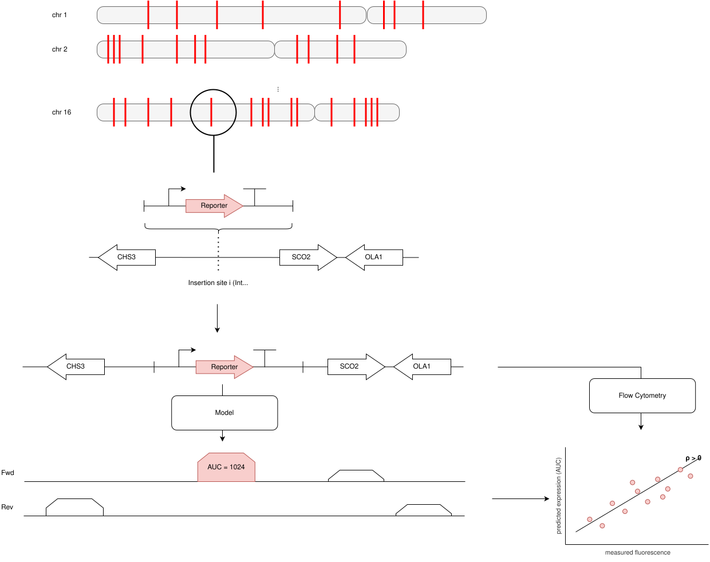
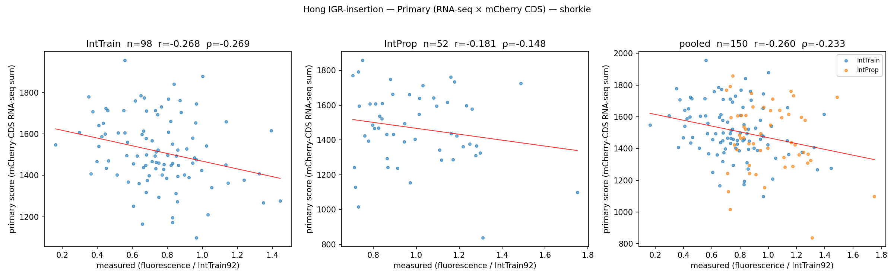
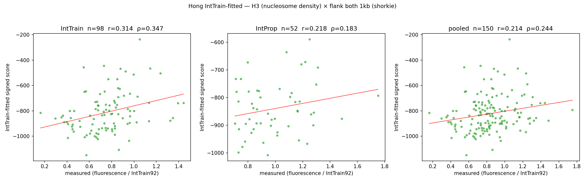

# Hong et al. — Chromosomal-position effects on IGR-integrated mCherry



## At a glance

| | |
| --- | --- |
| **Task** | Regression: predict mean mCherry fluorescence (normalized to a reference site) of a **constant** `TDH3p-mCherry-ADH1t` reporter cassette CRISPR-Cas9 integrated into one of 150 distinct intergenic regions (IGRs) in *S. cerevisiae*. **Position-effect** task: cassette/promoter/CDS/terminator are fixed; only the genomic insertion site varies. |
| **Source** | Hong et al. 2026, bioRxiv ([DOI](https://doi.org/10.64898/2026.04.06.716637)). PDF + supp data in `archive/hong/` + `data/tasks/hong/`. |
| **Assay** | The `TDH3p-mCherry-ADH1t` expression cassette is integrated into a chosen IGR of *S. cerevisiae* BY4741 (`MATa his3Δ1 leu2Δ0 met15Δ0 ura3Δ0`) using CRISPR-Cas9. Donor DNA is PCR-amplified from the cassette template with primers carrying 40 bp homology arms matching the chromosome up- and downstream of the gRNA-defined cut site. Steady-state mCherry mean fluorescence is read by flow cytometry (BD LSRFortessa, 561 nm ex / 610/20 nm em, 30 000 events per sample), normalized to the reference site `IntTrain92` (fluorescence ≔ 1.0). |
| **Sibling of Wu (vs differences)** | Wu integrates into a *deleted ORF span* (CDS replacement at the YKO *kanMX* locus); Hong integrates into a *preserved intergenic region* between two intact genes. Wu's cassette ≈ 3.5 kb consumes ~70 % of Yorzoi's receptive field; Hong's ≈ 1.6 kb consumes ~30 %. The biology Hong tests is *position-effect on a foreign cassette in preserved native context* — closer to the rational pathway-engineering question. |
| **Reference assembly** | *S. cerevisiae* R64-5-1 (SGD release 2024-05-29). Matches what the YeIP code repo bundles; Hong's paper Methods say R64-4-1 but the running code uses R64-5-1, and they're sequence-identical for our IGR set. FASTA at `data/tasks/R64-5-1.fa`. |
| **Expression label** | `fluorescence_norm_intrain92`: scalar per locus, mCherry mean fluorescence ÷ `IntTrain92` fluorescence. Dynamic range across IntProp 90/10 percentile ≈ **1.73×** (~0.7–1.2); IntTrain wider, ~2.3× 90/10. Distribution roughly unimodal centred near 1.0 for IntProp, near 0.75 for IntTrain. |
| **Test set size** | **150 unique measured loci (98 IntTrain + 52 IntProp), 0 drops.** No training set on our side — the model is zero-shot. *YeIP* was trained on the 98 IntTrain and validated on the 52 IntProp; we mirror that split for tiered reporting. |
| **Primary metric** | **Spearman ρ** on IntProp (n = 52), using RNA-seq × mCherry-CDS readout. Fixed per model, apples-to-apples across models. Tests the principled causal chain: mRNA → fluorescence. |
| **IntTrain-fitted IntProp ρ (secondary)** | **Spearman ρ** on IntProp using the **best (track group × readout region) combination selected on IntTrain** (signed scores; biological signs applied). A soft form of supervised feature engineering. Diagnoses each model's *upper bound* given its track inventory. Adapters opt in by implementing `predict_diagnostic_readouts(loci)`. |
| **Adapter protocol** | `IGRInsertionExpressionPredictor` — distinct from Wu's `CassetteExpressionPredictor` since the cassettes, locus shapes, and window-anchor conventions differ. Optional extension: `predict_diagnostic_readouts(loci) → dict[name, scores]` for IntTrain-fitted selection. |

## Headline ceiling

Hong reports **SPCC = 0.847** between RT-qPCR mCherry mRNA and mCherry fluorescence across 30 (promoter × IGR) combinations (Fig. 2H/I), recorded in `summary.json` as `mrna_fluo_ceiling_spcc_published`. Caveats about selection-biased / model-specific noise ceilings live in [`model_failures.md`](model_failures.md), not here.

## Contents

- [At a glance](#at-a-glance)
- [Headline ceiling](#headline-ceiling)
- [Results](#results)
- [Dataset construction](#dataset-construction)
- [The construct](#the-construct)
- [Model contract](#model-contract)
- [Evaluation protocol](#evaluation-protocol)
- [Files](#files)
- [Open questions / future work](#open-questions--future-work)

## Results

*2026-05-29 run.*

| Model | Primary IntProp ρ | Primary IntTrain ρ | IntTrain-fitted readout | IntTrain-fitted IntProp ρ | IntTrain selection ρ | Candidates considered |
| --- | ---: | ---: | --- | ---: | ---: | ---: |
| **Shorkie** | −0.148 | −0.269 | **H3 (nucleosome density) × flank both 1 kb** | **+0.183** | +0.345 | 36 |
| **Yorzoi**  | +0.063 | −0.073 | All + tracks (baseline) × flank L 1 kb | −0.016 | +0.113 | 24 |
| *Reference: YeIP (supervised, published-external)* | — | — | tabular features on 10 hand-engineered features | **+0.556** | — | — |

The YeIP row is published-external (Hong et al.'s supervised model on
hand-engineered features), not a run we reproduce — see "not doing in v1"
below.





### What the numbers say

- **Shorkie's IntTrain-fitted IntProp ρ is a clean, biologically
  interpretable positive result.** The picked combo — predicted H3
  nucleosome density at the immediate native flank, sign-flipped —
  gives IntProp ρ = +0.183, a ~0.33 absolute improvement over its
  Primary. Direction agrees with YeIP's "nucleosome density lower
  in high-expression IGRs."
- **Yorzoi's IntTrain-fitted IntProp ρ is *worse* than its Primary**
  (−0.016 vs +0.063). Selection on IntTrain lands on the baseline
  all-plus-tracks group at the left flank, and that combo doesn't
  generalize to IntProp — because Yorzoi's track inventory is
  RNA-seq only, with no chromatin-density tracks to pick the signal
  Shorkie's H3 combo finds. The asymmetry is itself the finding:
  models with richer track inventories pick up more of the
  position-effect signal.
- **Apples-to-apples (Primary), Yorzoi > Shorkie** (+0.063 vs
  −0.148). On the same readout strategy, Yorzoi is mildly better.
  Both are far below the YeIP supervised baseline.

Why the numbers look the way they do:
[`model_failures.md`](model_failures.md). Full per-tier breakdown +
artifacts: `results/default/{shorkie,yorzoi}__hong_igr/`.

## Dataset construction

### Sources

Tables from `data/tasks/hong/YeIP_supp_table_R2_20260411.xlsx`:

| Sheet | What it gives us | What we ignore |
| --- | --- | --- |
| **Table S1** | 98 IntTrain locus names + gRNA sequences (used to verify each cut site against R64-5-1). 2 IntTrain rows have no listed gRNA. | — |
| **Table S2** | 52 IntProp locus names + gRNA sequences + **fluorescence labels**. Plus the IntTrain92 reference row. | — |
| **Table S3** | Expression cassette sequences. Row 1 = `TDH3p-mCherry-ADH1t`, 1595 bp — the cassette we use. | The other 8 promoter variants. |
| **Table S4** | 98 IntTrain loci with `chr`, `int_site`, **`fluo_intensity`** (label). Only the label is read; coords are re-derived from gRNA matching where possible. | The 10 YeIP feature columns. |
| **Table S5** | Genome-wide YeIP predictions for 589 IGRs. **The `chr`/`int_site` columns are inconsistent with Table S2's gRNA assignments for 17 of 52 IntProp loci.** We use Table S2's gRNA as ground truth and ignore S5 entirely. | All of it. |

### gRNA-derived coordinate resolution

Every locus's `integration_coord` is the experimentally-realized
Cas9 cut site, derived from Table S1/S2's gRNA by searching R64-5-1
and applying the SpCas9 cut-position rule (between protospacer
0-indexed positions 16 and 17):

| Set | gRNA verified | Falls back to Table S4 `int_site` |
| --- | ---: | ---: |
| **IntTrain (98)** | 96 | 2 (no gRNA listed in Table S1) |
| **IntProp (52)** | 52 | 0 |

**Total: 150 loci, 0 drops.**

### Output

`data/tasks/hong/hong_igr_v1.tsv`, **150 rows**:

| Column | Type | Notes |
| --- | --- | --- |
| `locus_id` | str | `IntTrain{N}` or `IntProp{N}` |
| `set` | str | `IntTrain` (98) / `IntProp` (52) |
| `chrom` | str | Roman without `chr` prefix (`I`..`XVI`) |
| `integration_coord` | int | 1-based; experimentally-realized cut site |
| `fluorescence_norm_intrain92` | float | label |
| `gRNA` | str (nullable) | gRNA from Table S1 / S2; NaN for the 2 IntTrain fallback rows |

## The construct

Cassette: `TDH3p-mCherry-ADH1t`, **1595 bp total**, at
`data/tasks/hong/expression_cassette.fasta`. Verified sub-feature
layout:

| Feature | 0-based offset | Length |
| --- | ---: | ---: |
| **TDH3 promoter** | 0–686 | 686 |
| **mCherry CDS** (readout) | 686–1397 | 711 incl. TAA stop |
| **ADH1 terminator** | 1397–1595 | 198 |

### Cassette orientation: always `+`

Hong's donor DNA carries 40 bp homology tails matching the chromosome
up- and downstream of the cut. After HDR the chromosome's + strand
reads `[upstream] [cassette] [downstream]`, all + strand, so the
cassette's written 5'→3' direction always matches the chromosome's +
strand and mCherry transcription is always on +. For Yorzoi we always
use the +-strand track subset (tracks 0–80) — no per-locus strand
routing.

## Model contract

`HongIGRInsertionBenchmark.evaluate(adapter)` accepts any
`IGRInsertionExpressionPredictor`:

```python
class IGRInsertionExpressionPredictor(Protocol):
    def predict_expressions(self, loci) -> np.ndarray:
        """Primary scoring (RNA-seq × mCherry-CDS readout)."""
        ...

    # Optional IntTrain-fitted extension (hasattr-based duck typing)
    def predict_diagnostic_readouts(self, loci) -> dict[str, np.ndarray]:
        """Multiple candidate readouts with biological signs applied.
        Returns dict {readout_name: signed_scores_per_locus} including
        a 'primary' key. All other keys are candidates for IntTrain
        selection."""
        ...
```

`HongLocus` (frozen dataclass): `locus_id, set, chrom,
integration_coord`. Window construction (cassette centered, window
seq_len model-dependent) lives in `_hong_scaffold.py`, which
delegates to the shared `_cassette_scaffold.py`.

### Window-anchor strategy: centered cassette

Cassette midpoint at window midpoint. Yorzoi's 4992 bp window
leaves ~1.7 kb of native flank each side; Shorkie's 16,384 bp
leaves ~7.4 kb each side. This differs from Wu's
"readout-at-downstream-edge" anchor and is more appropriate for
intergenic insertion where signal can come from either flank.

### IntTrain-fitted candidate selection space

Per the spec design discussion, biological signs are pre-declared
(not data-fit). Active marks and RNA-seq tracks get sign +1
(more = more expression); nucleosome density gets sign −1.

**Shorkie selection space** (36 candidates):

| Track group | Sign | Source |
| --- | ---: | --- |
| RNA-seq T0 | +1 | `SHORKIE_T0_RNA_SEQ_TRACK_IDS` |
| H3K27ac (active) | +1 | Chip-MNase H3K27AC_S{0,1} |
| H3K4me3 (active promoter) | +1 | Chip-MNase H3K4ME3_S{0,1} |
| H3K9ac (active) | +1 | Chip-MNase H3K9AC_S{0,1} |
| H3K36me3 (gene body) | +1 | Chip-MNase H3K36ME3_S{0,1} |
| H3 (nucleosome density) | **−1** | Chip-MNase H3_S{0,1,2} |

**Yorzoi selection space** (24 candidates, RNA-seq only):

| Track group | Sign | Source |
| --- | ---: | --- |
| All + tracks (baseline) | +1 | tracks 0..80 of `track_annotation.json['+']` |
| JS94 (WT yeast) | +1 | `JS94_*` tracks |
| SCRaMBLE strains | +1 | `JS\d+_*` minus JS94 |
| Brooks Nanopore yeast | +1 | All `JS\d+_*` tracks |

**Readout regions** (same set for both models; computed in window
coordinates around the centered cassette):

- cassette CDS (= the mCherry CDS bins, = Primary readout location)
- cassette full (TDH3p + mCherry + ADH1t)
- flank L 1 kb (1 kb immediately 5′ of cassette)
- flank R 1 kb (1 kb immediately 3′ of cassette)
- flank both 1 kb (union)
- flank both 3 kb (3 kb each side, union)

The Primary readout for Shorkie is `RNA-seq T0 × cassette CDS`;
for Yorzoi, `All + tracks (baseline) × cassette CDS`. Both are
included in the diagnostic candidate set, so selection can in
principle pick them again — in which case the IntTrain-fitted readout equals
Primary (no improvement, which is itself an informative outcome).

## Evaluation protocol

1. Adapter returns scores. If it implements `predict_diagnostic_readouts`,
   the benchmark uses that dict; otherwise calls `predict_expressions`.
2. **Per-tier Primary metrics** for each of `{IntTrain, IntProp, pooled}`:
   - Spearman ρ (primary), Pearson r, top-k enrichment at k ∈ {3, 5, 7, 10}.
3. **IntTrain-fitted selection** (if readouts available):
   - For each non-`'primary'` candidate: compute signed ρ on IntTrain.
   - Pick the argmax. If the pick doesn't beat the Primary's IntTrain ρ,
     report IntTrain-fitted = Primary (no improvement).
   - Compute the picked readout's signed ρ on IntProp + pooled.
4. **Headline**: per-model line containing both Primary IntProp ρ and
   IntTrain-fitted IntProp ρ (+ the readout name picked).
5. **Plots**: per-tier Primary scatter, top-k enrichment, per-tier
   IntTrain-fitted scatter (if available).

### What we're *not* doing in v1

- **Cold-spot tier** (Supp Fig. S14): per-locus values unavailable
  in supp tables.
- **YeIP supervised reference baseline** (roadmap item).
- **Kong et al. 2022 external validation set** (roadmap item).
- **Promoter × IGR and carbon-source sub-tasks** (roadmap items).
- **5-fold CV selection-stability** as a scored output. The deep-
  dive notebook does the CV check; if IntTrain-fitted promotion to
  the headline becomes load-bearing, we can add an
  `inttrain_fitted_cv_stable` flag to `summary.json` in v2.
- **Bootstrap CIs** (standard v2 deferral).

## Files

### Inputs (committed to the repo)
- `data/tasks/hong/YeIP_supp_table_R2_20260411.xlsx` — supplementary
  tables S1–S6, source of every per-locus value.
- `data/tasks/R64-5-1.fa` (gitignored; ~12 MB; downloaded from
  SGD's R64-5-1 archive, headers normalized to bare Roman).

### Reference materials (not consumed by code)
- `archive/hong/YeIP_supp_R2_20260407.pdf` — supplementary text +
  figures. Human-reference only.

### Build script
- `scripts/hong/build_hong_distribution.py` — reads the xlsx, derives
  each locus's experimental cut site from its gRNA → R64-5-1 match,
  writes the TSV + cassette FASTA to `data/tasks/hong/`. Asserts
  all 52 IntProp gRNAs uniquely resolve in R64-5-1.

### Processed distribution
- `data/tasks/hong/hong_igr_v1.tsv` — 150 rows.
- `data/tasks/hong/expression_cassette.fasta` — frozen
  `TDH3p-mCherry-ADH1t` cassette, 1595 bp.

### Code
- `src/yeastbench/adapters/_cassette_scaffold.py` — shared
  insertion-context machinery (used by both Wu and Hong).
- `src/yeastbench/adapters/_wu_scaffold.py` — thin Wu layer.
- `src/yeastbench/adapters/_hong_scaffold.py` — thin Hong layer +
  diagnostic readout-region helpers.
- `src/yeastbench/adapters/{shorkie,yorzoi}_hong.py` — adapters with
  Primary + IntTrain-fitted IntProp ρ.
- `src/yeastbench/benchmarks/hong_igr.py` — benchmark class.
- `src/yeastbench/adapters/protocols.py` — `IGRInsertionExpressionPredictor`.
- `tests/test_hong_igr.py` — 30 tests covering scaffold, benchmark,
  per-locus readout-bin aggregation, IntTrain-fitted selection,
  save/load roundtrip, back-compat.

### Diagnostic notebook (gitignored)
- `notebooks/hong_predictions_deep_dive.ipynb` — annotated per-locus
  sample predictions, Section 7 noise-limited ceiling simulation,
  Section 8 multi-track readout sweep, Section 10 IntTrain →
  IntProp selection + 5-fold CV, Section 12 upstream-only H3
  length sweep.

## Open questions / future work

- **IntTrain-fitted CV stability is borderline.** 5-fold CV on
  IntTrain in the notebook shows Shorkie picks 2 different combos
  across folds (both H3 nucleosome at flank, different region
  widths). Selection is "stable in track type, unstable in exact
  region." For v2 we could (a) report `inttrain_fitted_cv_stable: bool` in
  summary.json with a warning, or (b) pick a more conservative
  selection rule (e.g., majority pick across folds).
- **The Shorkie chromatin advantage might not generalize across
  models.** Yorzoi's lack of histone-mark tracks means it can't
  pick up Hong's chromatin signal. Future models with richer
  yeast track inventories should automatically benefit; future
  models with only RNA-seq won't. The benchmark surfaces this
  asymmetry; we shouldn't paper over it.
- **The upstream-only H3 length sweep** (notebook Section 12)
  suggests the best upstream window is 750 bp on IntProp (ρ ≈
  +0.28) but 3 kb on IntTrain (ρ ≈ +0.19). Not promoted into
  the IntTrain-fitted selection space — the "flank L 1 kb" and "flank
  both 1 kb" regions roughly capture the same signal — but worth
  exploring further if the chromatin readout becomes load-bearing.
