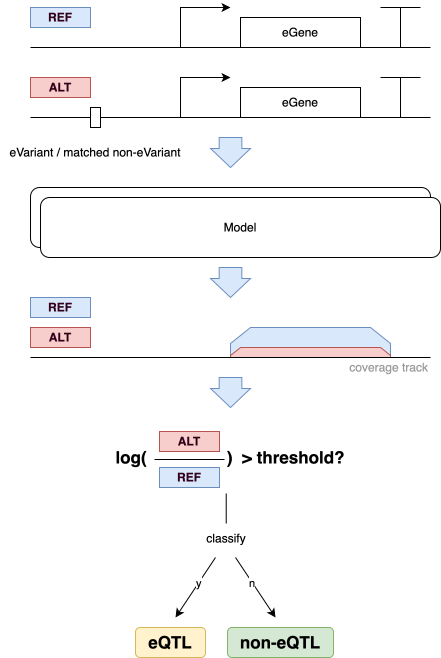

# Kita et al. — yeast cis-eQTL classification



## At a glance

| | |
| --- | --- |
| **Task** | Binary classification: is this `(variant, gene)` pair a cis-eQTL, or a distance-matched non-eQTL control? Identical task definition to [Caudal](caudal_eqtl.md). |
| **Assay** | cis-eQTL mapping (Kita et al. panel). |
| **Eval set** | 619 paired (positive, negative) rows per negative set × 4 sets. |
| **Adapter protocol** | `VariantEffectScorer.score_variants` (shared with Caudal). |
| **Source** | Kita, R., Venkataram, S., Zhou, Y. & Fraser, H. B. *High-resolution mapping of cis-regulatory variation in budding yeast.* PNAS 114 (2017), DOI: [10.1073/pnas.1717421114](https://doi.org/10.1073/pnas.1717421114). Summary statistics in supplementary file [`pnas.1717421114.sd01.txt`](https://www.pnas.org/doi/suppl/10.1073/pnas.1717421114/suppl_file/pnas.1717421114.sd01.txt). 1,640 raw eQTLs called from 85 *S. cerevisiae* isolates. |
| **Reference assembly** | *S. cerevisiae* R64-1-1, Ensembl release 115 (shared with Caudal). |
| **Background population for negatives** | 1011 yeast isolates panel (`1011Matrix.gvcf`, shared with Caudal). The Kita eQTLs themselves are called from a separate 85-isolate panel; the 1011 panel is used only as the source of distance-matched non-eQTL controls. |
| **Positives** | 683 cis-eQTLs selected from the raw 1,640, restricted to four genomic contexts — **Promoter, UTR5, UTR3, ORF**. The cis threshold is then applied as `|ChrPos − TSS| ≤ 8000`. The selection of 683 follows the Shorkie paper's reproduction; the upstream Kita release contains more variants but only these four context categories are used in the canonical evaluation. **Note: this is a different cis criterion from Caudal's 25 kb-of-gene-body rule** — see [Open questions](#open-questions--future-work). The shipped distribution has 619 pairs per negative set (4 sets). |
| **Negatives** | Identical procedure to Caudal: REF/ALT-matched non-coding variants from the 1011 panel with AF ≥ 0.05, distance-to-TSS-matched to ±100 bp (fallback ±200 bp), four independent iterations, with the same v1 same-chromosome post-filter. |
| **Primary metric** | AUROC and AUPRC, no class balancing, mean ± SEM across the four negative-set iterations, **with random and perfect baselines on the plots** (same form as Caudal). |

## Contents

- [At a glance](#at-a-glance)
- [Results](#results)
- [Why this benchmark exists](#why-this-benchmark-exists)
- [Dataset construction](#dataset-construction)
- [Distribution](#distribution)
- [Model contract](#model-contract)
- [Evaluation protocol](#evaluation-protocol)
- [Files](#files)
- [Open questions / future work](#open-questions--future-work)

## Results

*No model run yet (TBD).* The processed distribution is built and manifest-locked (4 negative sets), but neither model has been scored on Kita: `results/default/yorzoi__kita_eqtl/` is an empty placeholder and there is no Shorkie run, so Kita has no entry in `results/default/compare/`. Numbers below are filled in once the runs land — do **not** borrow Caudal's.

| `|score|` metric (mean ± SEM, 4 negative sets) | Shorkie | Yorzoi |
| --- | ---: | ---: |
| AUROC, full set | TBD | TBD |
| AUPRC, full set | TBD | TBD |
| AUROC, close-only (≤ 2 kb) | TBD | TBD |

Once both runs complete, report alongside Caudal (same scoring contract) so the cross-dataset comparison is visible. Why the numbers look the way they do, when present: [`model_failures.md`](model_failures.md).

## Why this benchmark exists

Kita is the **counterpart benchmark to Caudal**: same task, same scoring
contract, same evaluation pipeline, same negative-construction recipe,
but positives drawn from a separate eQTL study with a different isolate
panel. The pair gives the suite two cis-eQTL classification benchmarks
that share all of their evaluation machinery and differ only in the
source of positives. That makes them useful for diagnosing whether a
model's apparent skill on Caudal generalizes or is dataset-specific.

The expected use is to **report both benchmarks alongside each other**
for any yeast sequence-to-expression model in scope.

The headline difference in dataset construction is that **Kita
explicitly selects positives in four genomic contexts (Promoter, UTR5,
UTR3, ORF)**, while Caudal accepts any single-nucleotide variant whose
position is within 25 kb of the regulated gene's body. That selection
makes Kita's positives concentrated in functionally meaningful regions
with larger expected effect sizes, but it also means the two benchmarks
do not have identical cis criteria — keep that in mind when comparing
absolute numbers across them.

## Dataset construction

### Positive set
1. Download `pnas.1717421114.sd01.txt` from the PNAS supplementary
   materials. This is the canonical Kita et al. release, containing
   1,640 eQTLs called on 85 *S. cerevisiae* isolates.
2. Restrict to the 683 variants annotated in one of the four genomic
   contexts: **Promoter, UTR5, UTR3, ORF**. This selection is inherited
   from the Shorkie paper's reproduction; it is not part of the Kita
   release itself, and a future version of the benchmark could choose
   a different selection.
3. Compute the absolute distance between `ChrPos` and the target
   gene's TSS using the Ensembl 115 GTF. Classify as cis if
   `|ChrPos − TSS| ≤ 8000` on the same chromosome. Within Kita's
   selected 683 essentially all variants pass this threshold by
   construction.
4. Retrieve the reference and alternate alleles from `1011Matrix.gvcf`
   to ensure the variant is observed in the population panel that
   negatives will be drawn from.
5. Each retained row provides a `(chrom, pos, ref, alt, gene)` tuple.
   The context annotation (Promoter / UTR5 / UTR3 / ORF) drives the
   683-variant selection but is **not** carried through into the
   processed distribution — the shipped negsets use the same column
   set as Caudal; see [Schema](#schema).

### Negative set
**Identical procedure to Caudal** — see
[Caudal — Negative set](caudal_eqtl.md#negative-set) for the
five-step distance-/REF-/ALT-/MAF-matched sampling algorithm.

The shipped Kita negsets did **not** come from running
`scripts/eqtl/0_data_generation/1_generate_negs.py --dataset kita`.
They are the output of Kuanhao Chao's emailed pipeline (Ensembl Fungi
release 59), re-annotated to Ensembl 115 for `pos_gene_strand` /
`neg_gene_strand`; all other Kuanhao-generated columns are kept as-is.
That script is the regeneration target, not the source of record. Its
only Kita-specific bit is the input column parsing — it reads `#Gene`
(with the literal `#` prefix) instead of Caudal's `Pheno`.

As in Caudal, negatives are drawn genome-wide — the negative variant need
not share a chromosome with its paired positive (see
[Caudal — Cross-chromosome negatives](caudal_eqtl.md#cross-chromosome-negatives)).
In the shipped Kita negsets ~94% of pairs are cross-chromosome.

The matching properties (✅ REF/ALT, ✅ distance, ✅ MAF, ✅
same-chromosome) apply identically to Kita.

## Distribution

Same two-layer split as Caudal: raw upstream data lives at
`data/tasks/kita_eqtl/` (Kita-specific) and `data/tasks/` (shared
references + 1011 gVCF), and the processed benchmark distribution is a
flat-file release that adapters consume directly. Same hosting target:
a **GCP bucket** (`gs://yeast-seq2expression/kita_eqtl_v1/`, exact URL
pinned in the v1 release notes).

### Processed file layout

```
data/tasks/
├── R64-1-1.fa            # shared with caudal_eqtl
├── R64-1-1.fa.fai
├── R64-1-1.115.gtf       # shared
└── kita_eqtl/
    ├── README.md
    ├── negset_1.tsv
    ├── negset_2.tsv
    ├── negset_3.tsv
    └── negset_4.tsv
```

### Schema

**Identical to [Caudal's paired schema](caudal_eqtl.md#schema).** The
shipped `negset_*.tsv` header is exactly the 15 paired columns:

```
pair_id  pos_chrom  pos_pos  pos_ref  pos_alt  pos_gene  pos_gene_strand  pos_distance_to_tss  neg_chrom  neg_pos  neg_ref  neg_alt  neg_gene  neg_gene_strand  neg_distance_to_tss
```

There is no `pos_context` column — the context annotation drives the
683-variant selection upstream but is not carried into the
distribution. Same conventions as Caudal: Arabic-numeral chromosomes
(`1`..`16`), 1-based inclusive coordinates, sort by
`(pos_chrom, pos_pos)`, and the `pos_chrom == neg_chrom` invariant. A
Caudal adapter reads Kita's TSV without modification.

### Example head

The first rows of `negset_1.tsv` (tab-separated):

```
pair_id  pos_chrom  pos_pos  pos_ref  pos_alt  pos_gene  pos_gene_strand  pos_distance_to_tss  neg_chrom  neg_pos  neg_ref  neg_alt  neg_gene    neg_gene_strand  neg_distance_to_tss
0        1          31821    C        T        YAL062W   +                254                  10        294584   C        T        YJL077W-A   +                215
1        1          33113    G        A        YAL061W   +                335                  13        811472   G        A        YMR272W-B   +                383
2        1          33140    G        A        YAL061W   +                308                  13        46676    G        A        YML111W     +                266
3        1          33237    G        A        YAL061W   +                211                  14        250008   G        A        YNL211C     -                307
```

## Model contract

**Identical** to [Caudal — Model contract](caudal_eqtl.md#model-contract).
Same `VariantEffectScorer` protocol, same per-variant inputs, same
scalar output, same adapter responsibilities (window choice, strand
handling, ref-allele verification, output track choice, ref-vs-alt
reduction). The same Shorkie and Yorzoi reference adapters apply
without modification.

A model that has been wired up to score Caudal can score Kita with **no
adapter changes** — only the `distribution_dir` (and the
`kita_eqtl` benchmark name) change. See
[Caudal — Model contract](caudal_eqtl.md#model-contract) for the
worked `EQTLClassificationBenchmark` + adapter setup.

The same constraint on track aggregation applies: only the aggregate
is allowed, and per-call track picking is forbidden. Strand handling
follows the model's protocol — gene-sense strand for Shorkie, +
strand for Yorzoi. See
[Caudal — Reference example: Shorkie's scoring function](caudal_eqtl.md#reference-example-shorkies-scoring-function)
and [Caudal — Reference example: Yorzoi's scoring function](caudal_eqtl.md#reference-example-yorzois-scoring-function)
for the locked-in choices.

## Evaluation protocol

For each of the four negative-set iterations `i ∈ {1..4}`:
1. Score every positive and every paired negative with the model.
2. Compute AUROC and AUPRC over the union of positives and negatives
   in iteration `i`. **Do not subsample to balance classes.**
3. Record per-iteration metrics.

**Primary report:** mean ± SEM across the four iterations, plus the
per-iteration ROC and PR curves interpolated to a common grid with
±1 SEM bands. **Plots include random and perfect baselines** (same
form as Caudal: ROC random = `y = x`, perfect = `(0, 1)` step; PR
random = horizontal line at base rate, perfect = `(1, 1)` step).

**Standard secondary report:** AUROC and AUPRC stratified by
distance-to-TSS bin, using the shared `DISTANCE_BINS` from
`eqtl.py` (same bins as Caudal), plus the **close-only view** —
AUROC/AUPRC restricted to pairs with `pos_distance_to_tss ≤ 2 kb`
(`CLOSE_ONLY_THRESHOLD_BP`). A Kita-specific tighter bin override
(reflecting that Kita's selected variants concentrate closer to their
target genes) is a possible future addition — see
[Open questions](#open-questions--future-work).

**Note on per-context evaluation.** Kita's positives are selected by
genomic context (Promoter / UTR5 / UTR3 / ORF), but that label is not
carried into the v1 distribution, so v1 does **not** ship a per-context
report.

## Files

| Purpose | Path |
| --- | --- |
| Raw Kita sumstats | TBD — not yet committed to `data/tasks/kita_eqtl/`. ([source](https://www.pnas.org/doi/suppl/10.1073/pnas.1717421114/suppl_file/pnas.1717421114.sd01.txt)) |
| Background gVCF (1011 panel) | `data/tasks/1011Matrix.gvcf.gz` (shared with Caudal) |
| Reference GTF | `data/tasks/R64-1-1.115.gtf` (shared with Caudal) |
| Processed benchmark distribution | `data/tasks/kita_eqtl/negset_{1..4}.tsv` (built, manifest-locked); also mirrored to `gs://yeast-seq2expression/kita_eqtl_v1/` (GCP bucket; URL pinned in v1 release notes) |
| Negative-set source (shipped) | Kuanhao Chao's emailed pipeline (Ensembl Fungi 59, re-annotated to E115); see `data/tasks/kita_eqtl/README.md` |
| Negative-set regeneration | `scripts/eqtl/0_data_generation/1_generate_negs.py --dataset kita` (regeneration target, not the source of the shipped sets) |
| Shorkie variant scoring (upstream reference, SeqNN-based) | `scripts/eqtl/2_variant_scoring/score_variants_shorkie.py` — currently hardcoded against Kita's column conventions; reimplemented in the adapter on top of `src/yeastbench/models/shorkie.py`. |
| Architecture / API sketch | [`extending.md`](../extending.md) |
| Distance-stratified + close-only eval | `EQTLClassificationBenchmark` (shared `DISTANCE_BINS` and `CLOSE_ONLY_THRESHOLD_BP` in `src/yeastbench/benchmarks/eqtl.py`) |

## Open questions / future work

- The Kita raw sumstats file (`pnas.1717421114.sd01.txt`) is not
  committed to `data/tasks/kita_eqtl/`. Decide whether to vendor it (small) or
  download-on-demand from PNAS.
- **Reconcile the two cis criteria.** Caudal's v1 uses
  `type == 'CIS'` (25 kb of gene body); Kita's v1 uses
  `|ChrPos − TSS| ≤ 8000`. These are not equivalent. For v1 we inherit
  each dataset's source criterion; if a future version wants
  apples-to-apples comparison across the two it should consider
  unifying.
- Confirm the per-context labels in the upstream PNAS file. The
  Shorkie reproduction selects 683 variants by context, but the exact
  column name and category encoding from `pnas.1717421114.sd01.txt`
  is not yet documented in this entry; pin it before shipping `v1`.
- Confirm the negative-generation script's `#Gene` column expectation
  matches the actual upstream file (the literal `#` prefix is unusual
  and may have been introduced by a preprocessing step).
- **Kita-specific tighter distance bins.** v1 uses the shared
  `DISTANCE_BINS` plus the close-only (≤ 2 kb) view. A finer Kita
  override could better resolve the near-TSS concentration of Kita's
  selected variants; decide whether it earns its keep.
- The Shorkie variant-scoring script
  (`scripts/eqtl/2_variant_scoring/score_variants_shorkie.py`) is
  currently hardcoded against Kita's column conventions. The adapter
  reimplementation should consume the v1 paired schema directly (same
  for Caudal and Kita) so the same code path works for both.
- Once a third eQTL benchmark exists (likely Renganaath), extract the
  shared infrastructure sections (Distribution, Schema, Model contract,
  Evaluation protocol) into `docs/benchmarks/_template_eqtl.md` and have
  Caudal/Kita reference the template instead of cross-referencing
  each other.
