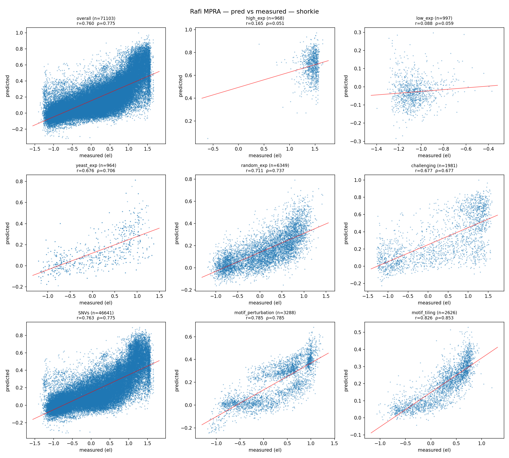

# Rafi / deBoer — random-promoter MPRA expression

> **Status:** zero-shot marginalized eval **implemented + run** (Shorkie, Yorzoi).
> DREAM-RNN supervised baseline — **implemented + unit-tested, not yet run on the
> 71k benchmark** (`dream_rnn` model; `tests/test_dream_rnn.py`). The published
> `0_1_1_0` checkpoint loads `strict=True` into the port. The overall Pearson
> *r* ≈ 0.97 quoted for it is its in-distribution reference *from the paper*, not
> a ybench number. **Data-op follow-up:** publish `model_best.pth` + `plasmid.json`
> to the HF/GCS mirrors so `ybench data get dream_rnn` works on a fresh checkout
> (lock entry already committed).

## At a glance

| | |
| --- | --- |
| **Task** | Regression: predict scalar expression for 71,103 random-promoter sequences across eight DREAM test-set strata. |
| **Source** | Rafi, Nogina, Penzar, *et al.* 2024, *A community effort to optimize sequence-based deep learning models of gene regulation*, Nat Biotechnol 43:1373–1383. DOI: [10.1038/s41587-024-02414-w](https://doi.org/10.1038/s41587-024-02414-w). The Random Promoter DREAM Challenge 2022. |
| **Assay** | GPRA. 80 bp random inserts cloned upstream of YFP in the `yeast_DualReporter` vector (AddGene 127546); FACS-sorted into 18 bins on `log2(RFP/YFP)`; per-sequence expression = MAUDE-fit bin mean. |
| **Expression label** | Scalar per sequence (`el` column, MAUDE expression). Stored at `data/tasks/rafi_mpra/filtered_test_data_with_MAUDE_expression.txt` (71,103 rows, tab-separated `seq`, `el`). |
| **Sequence format** | All 71,103 rows are exactly **110 bp** = 17 bp constant left adapter (`TGCATTTTTTTCACATC`) + 80 bp variable insert + 13 bp constant tail (`GGTTACGGCTGTT`). Verified: 100 % of rows match this layout. |
| **Eval set** | 71,103 sequences, split into 8 strata via `data/tasks/rafi_mpra/test_subset_ids/*.csv`: `high_exp`, `low_exp`, `yeast_exp`, `random_exp`, `challenging` (singleton) + `SNVs`, `motif_perturbation`, `motif_tiling` (pairs). |
| **Primary metric** | Per-stratum Pearson *r* + Spearman ρ on `(pred, el)`; for the three pair strata, also pair-difference Pearson/Spearman on `(pred_alt − pred_ref, el_alt − el_ref)`. |
| **Adapter protocol** | `SequenceExpressionScorer.predict_expression_scores(seqs) -> np.ndarray`. |

## Contents

- [Results](#results)
- [Two evaluation modes on one benchmark](#two-evaluation-modes-on-one-benchmark)
- [The supervised baseline: DREAM-RNN](#the-supervised-baseline-dream-rnn)
- [Caveats](#caveats)
- [Open questions / future work](#open-questions--future-work)

## Results

*Zero-shot, 2026-04-18 run (v1). Pearson r / Spearman ρ between predicted and measured expression over all 71,103 sequences.*

| Pearson r / Spearman ρ (n = 71,103) | Shorkie | Yorzoi | DREAM-RNN |
| --- | ---: | ---: | ---: |
| marginalized (`rafi_mpra_marginalized`) | 0.760 / 0.775 | 0.606 / 0.625 | — |
| direct reporter (`rafi_mpra_promoter`) | 0.739 / 0.747 | 0.458 / 0.407 | not run |

- Shorkie leads on both modes. Marginalizing the insert effect across native host contexts helps both models and helps Yorzoi most (Pearson 0.46 → 0.61).
- DREAM-RNN, the supervised baseline, is implemented and unit-tested but **has not been run on the 71k benchmark yet** (no results directory). The r ≈ 0.97 quoted for it is its in-distribution reference from the paper, not a ybench number.

Why the numbers look the way they do: [`model_failures.md`](model_failures.md). Artifacts: `results/default/{shorkie,yorzoi}__rafi_mpra_marginalized/summary.json` (and `__rafi_mpra_promoter/` for the direct mode).

## Two evaluation modes on one benchmark

The benchmark feeds every entrant the **same** 110 bp sequences and asks for one scalar per sequence; `MPRAMarginalizedBenchmark.evaluate` then correlates those scalars against the measured expression per stratum (`src/yeastbench/benchmarks/mpra.py:138`). It does not prescribe *how* the scalar is produced — that is the model's business. Two models answer the same ranking question through different machinery:

1. **Zero-shot, marginalized (Shorkie, Yorzoi)** — *implemented.* The insert is spliced into 22 native host-gene loci 180 bp upstream of the TSS; the scalar is the mean logSED (log fold-change in predicted host-gene expression) across loci (`adapters/_marginalized_mpra.py`). This is the honest zero-shot probe for genomic foundation models — they predict *effects in native context*, never reporter readouts.

2. **Supervised, in-distribution (DREAM-RNN)** — *this spec.* A model trained directly on this assay predicts the reporter expression of the insert itself, in its own plasmid context. No host genes, no marginalization.

Both emit a per-sequence scalar, both flow through the identical per-stratum metric. Because the metrics are Pearson/Spearman (scale- and shift-invariant), "mean logSED" and "predicted reporter expression" are compared on equal footing: each just has to *rank* sequences by expression. The measured label **is** reporter expression, which the supervised model predicts directly, so it sets the in-distribution reference a zero-shot model is reaching for.

## The supervised baseline: DREAM-RNN

### What it is — one model, not an ensemble

DREAM-RNN is a **single neural network** with a single set of weights. The DREAM paper built it with the *Prix Fixe* framework: it deconstructed the top-three challenge submissions into interchangeable blocks and searched all combinations; DREAM-RNN is the best combination built around the BHI team's recurrent core. The "composite" is in the *architecture's parts* (blocks sourced from different teams' designs, stacked into one `nn.Module`), not in combining models at inference. The paper endorses it as the best-*generalizing* of the optimized models; on the yeast task itself it scores ~0.815 weighted Pearson, within noise of the best (DREAM-CNN 0.822).

We use **only** DREAM-RNN — not DREAM-CNN, DREAM-Attn, or any original team model.

### Architecture (per the reference implementation)

Assembled as `PrixFixeNet(first, core, final)`, following the de-Boer-Lab `DREAMNets_BuildModel_Train_and_Predict.ipynb` and the vendored eval (`shorkie-paper/from_kuanhao/eQTL/data/eQTL_MPRA_models_eval/2_predict_seq_pos.py:90–123`):

| Block | Upstream class | What it is |
| --- | --- | --- |
| first | `BHIFirstLayersBlock` | parallel multi-kernel conv (kernels 9, 15; out 320; dropout 0.2) |
| core | `BHICoreBlock` | **bidirectional LSTM** (hidden 320/dir → 640) + multi-kernel conv (out 320; dropout1 0.2, dropout2 0.5) |
| final | `AutosomeFinalLayersBlock` | 1×1 conv → 18 bins → global avg-pool → softmax → expected-value scalar |

The upstream class names record which *team* designed each block; they are not separate models — the port renames them to neutral single-model names (`DreamRnn`, blocks without team prefixes). Weights are Zenodo record **10633252** (DOI [10.5281/zenodo.10633252](https://doi.org/10.5281/zenodo.10633252)), dir **`0_1_1_0/model_best.pth`** — a plain torch `state_dict`, no retraining. The dir name is `<dataprocessor>_<first>_<core>_<final>` with team codes `0`=Autosome, `1`=BHI, `2`=UnlockDNA, so `0_1_1_0` = Autosome data-processor + BHI first + **BHI (Bi-LSTM) core** + Autosome final = DREAM-RNN. This was confirmed by a strict `load_state_dict` (the dir has `core.lstm.*` and `final.mapper.0` in_channels 320); the de-Boer notebook comments mislabel `0_1_0_0` as RNN — the vendored eval script's mapping is right.

Input is 150 bp × 6 channels: the 80 bp insert is reflanked back into the plasmid context the model trained on (strip the 17 bp left adapter, prepend 150 bp upstream plasmid from `plasmid.json`, keep the last 150 bp), then encoded as 4 one-hot base channels (`N → 0.25`) + a reverse-flag channel + a zero singleton. Output is one scalar per sequence (softmax over 18 bins → expected value), forward and reverse-complement run through the same net and averaged (test-time augmentation, not an ensemble). Cost is ~142 k forward passes of a ~4 M-param net (71,103 × 2), seconds-to-minutes on GPU, vs. the foundation models' 22-loci marginalization.

### Implementation note (done)

All of this is implemented in code:

- **Model + adapter.** Ported net in `src/yeastbench/models/dream_rnn/` (`PrixFixeNet` + the three blocks, neutrally renamed; preprocessing `n2id`, `revcomp`, reflank, 6-channel encode, fwd+RC average). Adapter `DreamRnnRafiPredictor` in `src/yeastbench/adapters/dream_rnn_rafi.py` runs the net directly via `predict_expression_scores` — no host-gene loop. Registered as `dream_rnn` and enabled on `rafi_mpra_marginalized` in `configs/default.yaml`.
- **Protocol rename (behaviour-preserving).** The old `MarginalizedSequenceExpressionPredictor.predict_marginalized_expressions` was a misnomer for a model that does no marginalizing, so it is now `SequenceExpressionScorer.predict_expression_scores` across `adapters/protocols.py`, `_marginalized_mpra.py`, the Rafi + Shalem adapters/benchmarks, and `registry.py`.
- **Distinct styling + caption.** `benchmarks/mpra.py:compare_plot` draws `dream_rnn` as a hatched-grey bar labelled "supervised, in-distribution" and stamps a caption flag that each model is fed its native substrate (zero-shot models scored by marginalized logSED at native loci; DREAM-RNN scored on the reporter insert in its own plasmid context — not identical inputs).
- **Data still to stage.** `data/tasks/rafi_mpra/plasmid.json` (8,294 bp dual-reporter plasmid, `N×80` insert slot at index 3648, from de-Boer-Lab/random-promoter-dream-challenge-2022 `data/plasmid.json`) and the `0_1_1_0/model_best.pth` weights need publishing to the HF/GCS mirrors. The test data (`filtered_test_data_with_MAUDE_expression.txt`, 71,103 rows; `test_subset_ids/*.csv`; `public_leaderboard_ids/`) is already present.

## Caveats

- **Not an upper bound on the proxy task.** DREAM-RNN predicts the literally-measured quantity (reporter expression); the foundation models predict a native-context proxy. The comparison is fair as a *ranking* (what the plots show) and DREAM-RNN is the in-distribution reference — but it is not "the same model evaluated on the same inputs." The caption carries this.
- **Native / yeast_exp stratum.** DREAM-RNN was trained on random promoters; native-derived test sequences are themselves harder for it, so its reference value on `yeast_exp` is not a hard ceiling.
- **License.** Confirm the de-Boer-Lab repo license permits vendoring the blocks + `plasmid.json` into this repo before committing.
- **Adapter prefix assert.** All 71,103 sequences start with the 17 bp adapter (verified), but keep an assert in the reflank step so a malformed input can't be silently corrupted.

## Open questions / future work

- Run DREAM-RNN on the full 71k benchmark once `model_best.pth` + `plasmid.json` are on the HF/GCS mirrors, and add its per-stratum row to Results.
- Reconcile the de-Boer test-data path: confirm the vendored `filtered_test_data_with_MAUDE_expression.txt` is bit-identical to the upstream DREAM release before publishing leaderboard numbers.
