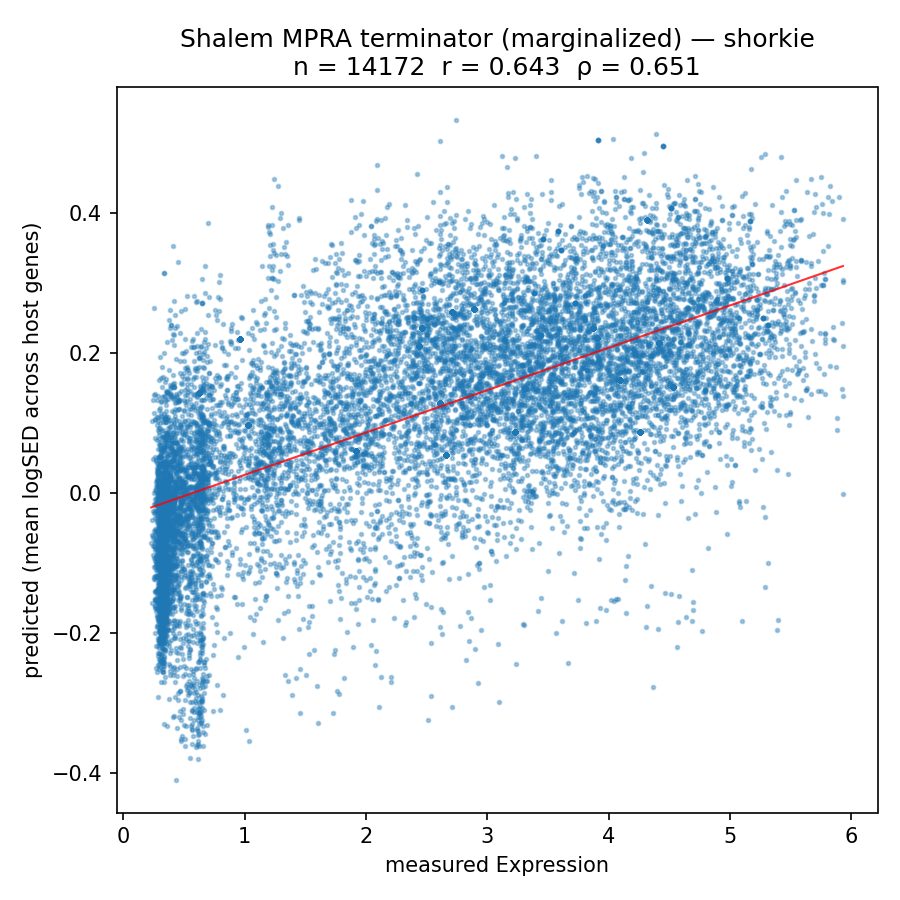
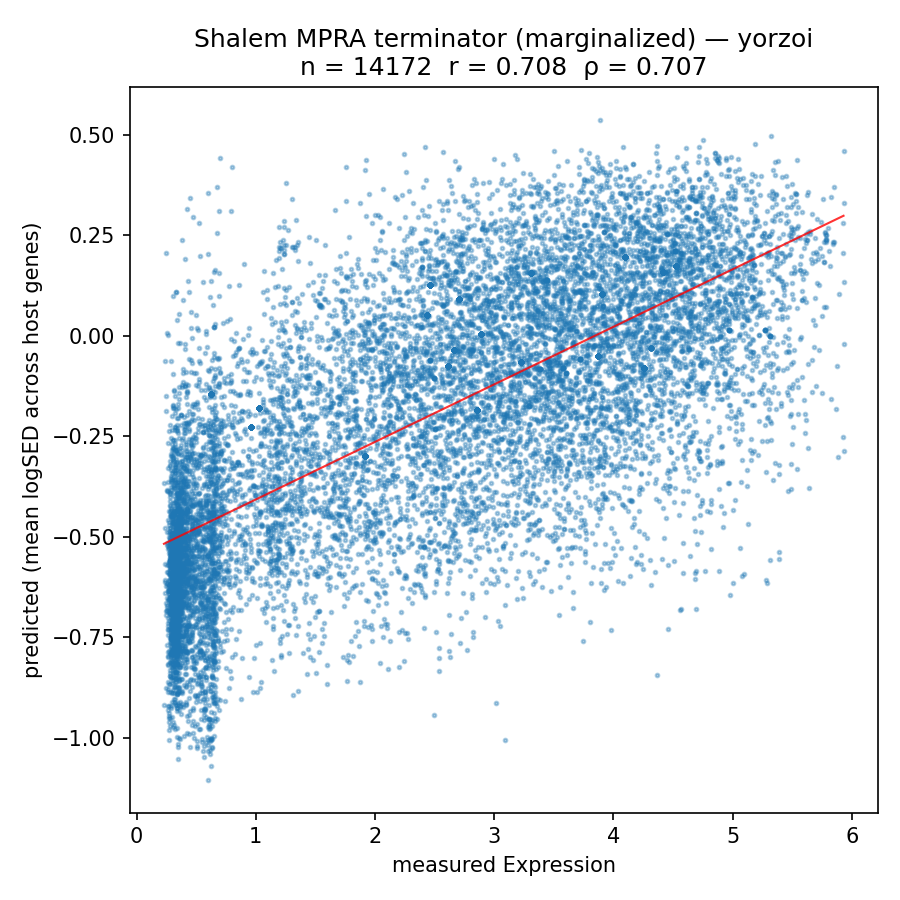

# Shalem et al. — 3′-end / terminator MPRA expression (marginalized)


## At a glance

| | |
| --- | --- |
| **Task** | Regression: predict scalar YFP expression for ~14 k designed 3′-end sequences, by marginalizing each sequence's predicted logSED effect across 22 native host genes. |
| **Source** | Shalem, Carey, Zeevi, Sharon *et al.* 2015, *Systematic dissection of the sequence determinants of gene 3′ end mediated expression control*, PLoS Genet 11(4): e1005147. DOI: [10.1371/journal.pgen.1005147](https://doi.org/10.1371/journal.pgen.1005147). In the vendored table the file is named `segal_2015.tsv` after Eran Segal (senior author). |
| **Assay** | MPRA. ~13,000 designed 150 bp oligos (Primer5 flank + 102 bp variable + barcode + Primer3 flank) cloned via SexAI + AvrII into a low-copy CEN plasmid between a `GAL1/10`-driven YFP and a `CYC1` CDS fragment + mutated (non-terminating) 3′-UTR. `pTEF2-mCherry-tADH1` serves as an internal reference. Yeast (Y8205) grown in 20 % galactose, sorted by `YFP/mCherry` into 16 bins; bins deep-sequenced; per-sequence expression fit as the gamma-distribution mean of its bin distribution. |
| **Expression label** | Scalar per sequence, gamma-fit mean of `log2(YFP/mCherry)`. Higher = more YFP = more efficient 3′-end processing / less readthrough. Expression column range ≈ `[0.23, 5.93]`, mean ≈ 2.50. |
| **Eval set** | 14,172 sequences with non-null `Expression` (of 14,955 designed rows; 783 rows have no expression estimate and are **dropped before evaluation**). |
| **Primary metric** | Overall Pearson *r* on `(pred, Expression)` across all non-null rows. Spearman ρ reported alongside. No per-stratum breakdown in v1 (see *Evaluation protocol*). |
| **Adapter protocol** | `TerminatorMarginalizedExpressionPredictor.predict_terminator_marginalized` (`src/yeastbench/adapters/protocols.py`). |

## Contents

- [At a glance](#at-a-glance)
- [Results](#results)
- [Why this benchmark exists](#why-this-benchmark-exists)
- [Construct (per host gene)](#construct-per-host-gene)
- [Host gene selection](#host-gene-selection)
- [Evaluation protocol](#evaluation-protocol)
- [Files](#files)
- [Open questions / future work](#open-questions--future-work)

## Results

*Zero-shot, 2026-04-17 run (v1). Pearson r / Spearman ρ between predicted and measured terminator effect, marginalized over 22 host genes.*

| metric (n = 14,172 scored of 14,955) | Shorkie | Yorzoi |
| --- | ---: | ---: |
| Pearson r | 0.643 | 0.708 |
| Spearman ρ | 0.651 | 0.707 |




- Yorzoi beats Shorkie here (Pearson 0.708 vs 0.643) — the **only** MPRA task in the suite where it does. The 3′-end / termination grammar sits closer to Yorzoi's RNA-seq-coverage training objective than the promoter and coding-sequence layers do.

Why the numbers look the way they do: [`model_failures.md`](model_failures.md). Artifacts: `results/default/{shorkie,yorzoi}__shalem_mpra_marginalized/summary.json`.

## Why this benchmark exists

The Shalem library is the only large, uniformly-measured panel of yeast 3′-end sequences. It probes a regulatory layer — cleavage, polyadenylation, termination efficiency, readthrough — underrepresented in the eQTL and promoter-MPRA benchmarks.

Fixed-context scoring (embedding each oligo in a plasmid-like scaffold) is **not in scope**. The marginalized approach, matching the design of our Rafi MPRA marginalized benchmark, is cleaner for three reasons:

1. It puts the model in-distribution (scoring a native genomic region with a local perturbation, not a bacterial/CEN plasmid construct).
2. It isolates the insert's effect via logSED, cancelling model dynamic-range miscalibration and scaffold-specific noise.
3. It matches how the MAUDE-style label was designed: a *relative* YFP readout.

## Construct (per host gene)

For each of the 22 host genes, at each test sequence evaluation, the model is fed a window of native genomic sequence centred on the host gene's CDS, with a fixed **450 bp region immediately downstream of the host's stop codon replaced** by:

```
─── 450 bp replacement, transcription direction ───

[150 bp Shalem oligo insert]
[100 bp CYC1 CDS tail]        ┐
                              ├── 300 bp no-termination filler
[200 bp cycl-512 mutant UTR]  ┘

─── native genomic sequence resumes from stop_codon + 451 onward ───
```

Only the 150 bp insert varies between test sequences; the 300 bp no-termination filler is identical for every test sequence and every host gene. It is constructed once at adapter init from CYC1 (YJR048W) and cached.

### Why the 300 bp no-termination filler

The Shalem plasmid has `YFP | INSERT | (CYC1 CDS fragment) | (mutated CYC1 3′-UTR)`, where the mutated UTR is the `cycl-512` allele from Guo *et al.* 1995 (PNAS 92:4211) with a 38 bp deletion of the efficiency-element region that eliminates 3′-end processing — so the **only** terminator in the transcribed window is the insert. Without the filler, the downstream of our insert would be the host gene's own native 3′-UTR and confound the measurement, so we replicate the plasmid's no-termination design by splicing in `(CYC1 CDS tail) + (cycl-512 mutant UTR)`.

**Filler construction** (at adapter init time):
1. Fetch CYC1 (YJR048W) CDS + 300 bp downstream from the R64-1-1 FASTA.
2. Locate the two `TATTTA` motifs in the 3′-UTR that flank the efficiency-element region (flanked upstream by a `TAGGTCCC` anchor and downstream by a `TATTTC` anchor). In R64-1-1 these are at positions 114–183 bp past the CYC1 stop codon.
3. Delete the 40 bp between and including the second `TATTTA` — produces a cycl-512-style non-terminator UTR. (R64-1-1 has a 40 bp region where Guo 1995 reported 38 bp — a strain/sequencing-era drift in the T-run before the second `TATTTA`. The structural lesion is identical.)
4. Concatenate the last **100 bp of CYC1 CDS** + first **200 bp of the mutant UTR** = fixed **300 bp filler**.

### For negative-strand host genes

The 150 bp insert is reverse-complemented. The 300 bp filler is reverse-complemented and placed **upstream** of the gene's `gene_start` (which is the stop codon in genomic coordinates for a − strand gene). Everything else mirrors the + strand case.

## Host gene selection

**22 host genes** — 10 positive-strand, 12 negative-strand — are selected once by a reproducible script and committed as `data/tasks/shalem_mpra_terminator/host_genes.json`. The adapter imports that artifact; no re-selection happens at run time.

### Filter (must pass)
1. `gene_biotype == "protein_coding"` in the GTF.
2. CDS length ≥ **300 bp** (enough exon bins for a stable track readout).
3. No same-strand gene starts within 500 bp downstream of the stop codon (so the 450 bp replacement doesn't clobber a neighbour's promoter or 5′ region).
4. No convergent (opposite-strand) gene overlaps the 500 bp downstream region.
5. Gene and 500 bp flanks fit within chromosome bounds with a 3 kb safety margin (well inside both Shorkie's 16 kb and Yorzoi's 4992 bp window placement constraints).
6. DEE2 median TPM ≥ 1.0 (excludes dubious ORFs / effectively-unexpressed genes).

### Diversification
- Strand balance: **10 positive, 12 negative** (matches Rafi marginalized).
- TPM-tertile stratification (low / medium / high, in log-TPM space): targets `{+low 3, +med 3, +high 4, −low 4, −med 4, −high 4}`.

### Expression data source

DEE2 (Digital Expression Explorer v2, [dee2.io](https://dee2.io/)) — per-gene median TPM across 49 PASS-QC S. cerevisiae RNA-seq runs, aggregated from DEE2's per-run STAR gene counts normalized by Ensembl longest-isoform length. Build pipeline:
- `scripts/shalem/build_dee2_median_tpm.py` — samples 50 PASS runs from `dee2_accessions.tsv.bz2`, fetches each via the DEE2 CGI endpoint, computes TPM, writes `data/tasks/dee2_gene_median_tpm.tsv`.
- `scripts/shalem/select_host_genes.py` — applies the filter + diversification above, writes `data/tasks/shalem_mpra_terminator/host_genes.json`.

The committed 22 genes span ~2.5 decades of TPM (1.2–158 TPM) and include well-annotated yeast loci (MUP1, NOG1, CTR1, KIP3, MDM38, AGP1, BRE1, HXT6/7, …).

## Evaluation protocol

For each of the 14,955 oligos in order:
1. For each of the 22 host genes:
   a. Build the input window: native context around host CDS, with the 450 bp replacement (`150 bp insert + 300 bp filler`) at `stop_codon + 1`.
   b. Forward-pass the model. `REF` baselines (native context, no insert) are pre-cached per host gene.
   c. Compute logSED over the host gene's exon bins using the `logSED_agg` convention (cross-track mean of exon-bin sums, then `log2(alt_sum + 1) − log2(ref_sum + 1)`).
2. Mean logSED across 22 host genes → scalar prediction.
3. Drop rows where `Expression` is NA (14,955 → 14,172).
4. **Overall Pearson *r*** on `(pred, Expression)`. **Spearman ρ** alongside.
5. Plots: overall scatter (pred vs. Expression with regression line and Pearson/Spearman annotated), histogram of predictions.

### What we're *not* doing in v1

- **Per-stratum breakdown**: the paper reports no per-stratum numbers and no weighted aggregate, so v1 reports overall Pearson only and defers the ~9-stratum breakdown (from the `Description` column's `SetName` values) to v2.
- **Barcode-duplicate collapsing**: the `duplicate barcodes hubs` / `hubs pos neg` groups contain designs that differ only in the 11 bp barcode. v1 treats each row as independent (no collapsing) — this is what the raw table provides. The paper reports a 13.2 % median RSD from these duplicates as the technical noise floor; results should be interpreted against that ceiling.
- **Bootstrap confidence intervals** (v2).

### Track subsets
- Shorkie: 384 T0 RNA-seq tracks (same as Rafi marginalized).
- Yorzoi: 81 plus-strand tracks for + strand host genes, 81 minus-strand tracks for − strand host genes (same strand-matched scheme as Rafi marginalized).

### RC averaging
Both adapters average forward + RC predictions. Yorzoi swaps + and − strand tracks on the RC pass (same as Rafi marginalized).

## Files

### Raw upstream
- `data/tasks/shalem_mpra_terminator/segal_2015.tsv` — 14,955 rows, tab-separated. Columns: `Design ID, Lib ID, Expression, Description, Oligo Sequence`. Source: Shalem 2015 S3 Table.
- `archive/Shalem/utils.py` — legacy Yorzoi fixed-context reference impl. Not used by this benchmark; retained for historical context only.
- `data/tasks/dee2_accessions.tsv.bz2` — DEE2 run accessions with QC flags.
- `data/tasks/dee2_gene_median_tpm.tsv` — per-gene median TPM across PASS runs (built by the DEE2 script above).

### Processed distribution
- `data/tasks/shalem_mpra_terminator/host_genes.json` — 22 host genes with strand, coordinates, median TPM, and selection metadata.

### Sequence format (150 bp oligo, verified against the raw TSV)

| Positions (1-based) | Length | Content |
| --- | ---: | --- |
| 1–19   | 19 bp | Primer5 flank (`GGGGACCAGGTGCCGTAAG`, fixed, SexAI site) |
| 20–121 | 102 bp | Variable 3′-end / terminator element |
| 122–132 | 11 bp | Barcode |
| 133–150 | 18 bp | Primer3 flank (`GCGATCCTAGGGCGATCA`, fixed, AvrII site) |

All 14,955 rows are exactly 150 bp and the two flanks are invariant. Adapters insert the full 150 bp (primer flanks + barcode included) — this matches the experimental construct and the Yorzoi-reference `r = 0.65` scaffold's intent.

> **Note on the `Description` column**: its `Primer5|Start=132,End=150` / `Primer3|Start=1,End=18` annotations use a reversed coordinate system (they describe the mRNA orientation, not the DNA cloning orientation of the oligo string). Ignore these fields — the actual oligo-string layout is as tabulated above.

### Sign convention (verified)

`Expression` is already in "higher = more YFP" orientation (range ≈ `[0.23, 5.93]`, mean ≈ 2.50). A *positive* logSED from the adapter means the model predicts the insert boosts expression of the host gene (a stronger terminator, in this assay's framing). Pearson correlation is expected to be positive.

### Zero-shot caveat

Shorkie and Yorzoi saw native yeast 3′-end sequences during training, so the few native-derived strata may overlap training examples — though the insert sits in a foreign host-gene context, not its native host. The vast majority of the library is random / mutated / synthetic, so this barely moves the overall Pearson number.

## Open questions / future work

- Per-stratum breakdown (committed `stratum_map.tsv` from the `Description` column's `SetName` values).
- Collapse barcode-duplicate designs and report against the paper's 13.2 % median-RSD noise floor.
- Bootstrap confidence intervals on the overall Pearson / Spearman.
