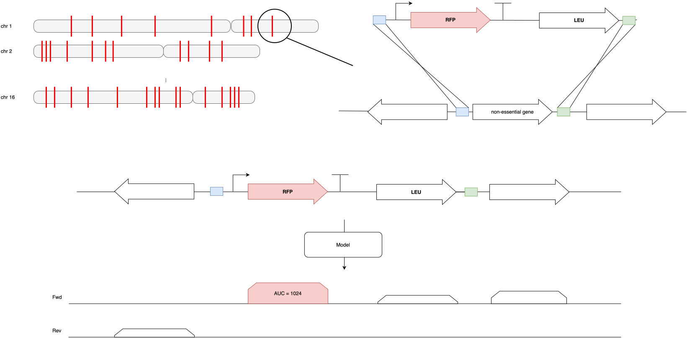
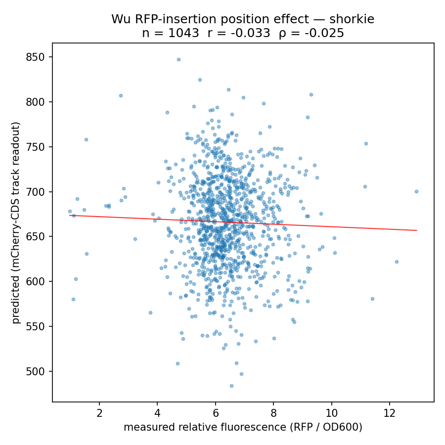
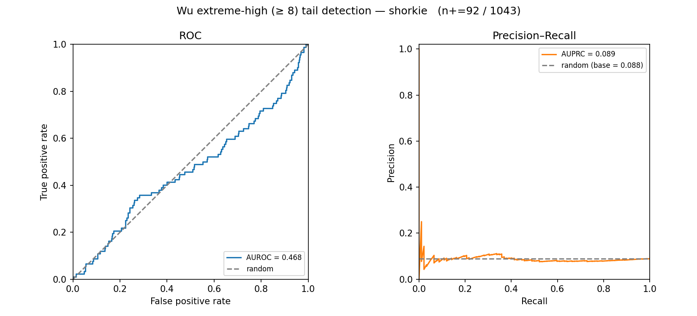

# Wu et al. — Genome-wide position effects on RFP cassette expression



## At a glance

| | |
| --- | --- |
| **Task** | Regression: predict OD600-normalised RFP plate-reader intensity for one fixed expression cassette integrated at 1044 different genomic loci. This is a **position-effect** task — the cassette and its promoter are constant; only the genomic insertion site varies. |
| **Source** | Wu, Li, Zhang, Song, Qi, Dai, Yuan 2017, *Genome-wide landscape of position effects on heterogeneous gene expression in Saccharomyces cerevisiae*, Biotechnol Biofuels 10:189. DOI: [10.1186/s13068-017-0872-3](https://doi.org/10.1186/s13068-017-0872-3). PDF + cassette reconstruction in `archive/wu/`. |
| **Assay** | The RFP expression cassette (`tCYC1 – pURA3 – RFP – pLEU2 – LEU2 – tLEU2`) is swapped into the ***kanMX* locus** of 1044 single-ORF deletion strains of the haploid MATα Yeast Knock-Out (YKO, BY4742) collection. The reporter plasmid carries homology arms `kanMX-L`/`kanMX-R` (homologous to the *kanMX* cassette, **not** the genomic ORF flanks), so recombination replaces *kanMX* and **inherits the YKO collection's genomic deletion boundary unchanged**. RFP fluorescence (ex 587 nm / em 610 nm, SpectraMax M2) is read in a plate reader and divided by OD600. Neither raw fluorescence, OD600, timepoints, nor the meaning of "error" are reported — only the ratio and its error. |
| **Caveats** | (1) The authors do not convincingly show relative intensity correlates with mRNA level (their high/low comparison is selection-biased). (2) The YKO collection carries known aneuploidies/secondary mutations, introducing *trans* effects no sequence-to-expression model captures ([Giaever 2014](https://doi.org/10.1534/genetics.114.161620)). (3) **The cis-regulatory sequence driving RFP is identical at all 1044 loci** — see *Why this benchmark exists*. |
| **Reference assembly** | *S. cerevisiae* R64-1-1. The cassette occupies the YKO collection's *kanMX* deletion locus; the splice uses the nominal SGDP precise start-to-stop ORF deletion (the documented per-locus "start codon scar" ≤3 bp ambiguity is immaterial — see *Integration geometry*). |
| **Expression label** | Scalar per locus: `Relative_Fluorescence_Average` (RFP / OD600), range ≈ `[0.98, 12.98]` (≈ 13-fold), roughly normally distributed (paper Fig. 1b, R² = 0.98 to a normal fit). `Relative_Fluorescence_Error` is provided but its definition is unspecified; not used for scoring in v1. |
| **Eval set** | 1044 loci (one cassette integrant per locus), uniformly scattered across all 16 chromosomes (~12 kb mean inter-locus spacing). No training set — purely zero-shot. |
| **Primary metric** | Pearson *r* and Spearman ρ between predicted and measured relative intensity across all 1044 loci. Two binary tail-detection tasks are secondary (see *Evaluation protocol*). |
| **Adapter protocol** | `CassetteExpressionPredictor`. Track-based models (Shorkie, Yorzoi) splice the cassette into the native genome at each locus and read out the RFP CDS. |

## Contents

- [Why this benchmark exists](#why-this-benchmark-exists)
- [Results](#results)
- [Dataset construction](#dataset-construction)
- [The construct](#the-construct)
- [Model contract](#model-contract)
- [Evaluation protocol](#evaluation-protocol)
- [Files](#files)
- [Open questions / future work](#open-questions--future-work)

## Why this benchmark exists

Every other benchmark in the suite varies the *cis*-regulatory sequence
and asks the model to predict the consequence. **This one does the
opposite.** The cassette — `pURA3` driving RFP, `tADH1`/`tLEU2`
terminators, a `tCYC1` insulator upstream — has the same *cis*-regulatory
sequence at all 1044 loci; the only intra-cassette variation is the two
strain-specific 20 bp molecular barcodes (UPTAG/DNTAG, inert random
sequence ~0.5 kb / ~2.2 kb from the mCherry readout, behind the `tCYC1`
insulator). The thing that actually changes between loci is the **genomic
neighbourhood** the cassette is dropped into: local chromatin
environment, neighbouring promoters and their orientation, distance to
centromere/telomere, replication context.

That makes this a clean, adversarial probe of one specific question: **do
sequence-to-expression models capture genomic *position* effects, or only
local promoter grammar?** A model whose receptive field is dominated by
the (constant) cassette promoter will predict a near-constant value for
every locus and score ≈ 0. Any real signal must come from the flanking
genomic context inside the model's receptive field. Shorkie (~16 kb) and
Yorzoi (~5 kb) windows each see several kb of native flank on either side
of the insertion, so the question is well-posed for them — but neither
was trained on position-effect data, and neither sees chromatin or
replication-timing tracks, so a low correlation here is a *finding*, not
a bug in the benchmark.

The paper itself supports the framing: Wu et al. show that swapping the
promoter, the reporter gene, or the carbon source barely moves the
per-locus expression — "chromosomal location is the major determinant of
reporter gene expression." The benchmark asks whether the models have
learned that determinant.

## Results

*Zero-shot, 2026-08-03 Modal run (v1). Pearson r / Spearman ρ between predicted and measured relative intensity across all loci; two binary tail-detection tasks scored by AUROC.*

| metric (n = 1,043 scored of 1,044) | Shorkie | Yorzoi |
| --- | ---: | ---: |
| Pearson r | −0.039 | 0.012 |
| Spearman ρ | −0.029 | 0.016 |
| extreme-low AUROC | 0.501 | 0.483 |
| extreme-high AUROC | 0.464 | 0.522 |




- A clean negative result: both models sit at zero correlation with measured intensity, and tail-class detection is at chance (AUROC ≈ 0.5). With the cassette and promoter held fixed and only the genomic insertion site moving, neither model captures position effect.

Why the numbers look the way they do: [`model_failures.md`](model_failures.md). Artifacts: `results/default/{shorkie,yorzoi}__wu_rfpins/summary.json`.

## Dataset construction

### Training data

None. There is no train split and we introduce none. Every model is
evaluated zero-shot on all 1044 loci.

### Test set (the benchmark)

`archive/wu/.../Additional file 1: Table S2`, vendored as
`data/tasks/wu_rfpins/table_s2_fluorescence_1044_loci.csv` — 1044 rows:

| Column | Meaning |
| --- | --- |
| `No.` | Integrant ID (`TH00001`…`TH01044`), paper's strain label. |
| `ORF_name` | Systematic name of the deleted ORF (e.g. `YAL068C`); the integration locus. Maps to R64-1-1 coordinates + strand via `R64-1-1.115.gtf`. |
| `Relative_Fluorescence_Average` | RFP/OD600, the regression label. |
| `Relative_Fluorescence_Error` | Reported error (definition unspecified); not scored in v1. |

The paper's Table S1 (list of selected loci) is not needed — `ORF_name`
plus the GTF fully determines each integration site.

### Paper's expression classes

Wu et al. divide the 1044 loci into **five fixed absolute-cutoff
classes** (Fig. 1b). Counts here are over all **1,044** designed loci; the
run scored **1,043** after dropping one unresolved ORF (YIR044C), so the
extreme-high tail task has 92 positives among the 1,043 scored loci:

| Class | Cutoff (RFP/OD600) | Count | Share |
| --- | --- | ---: | ---: |
| extreme low (red)    | `[0, 5)`   | 71  | 6.8 % |
| low (yellow)         | `[5, 6)`   | 311 | 29.8 % |
| moderate (green)     | `[6, 7)`   | 410 | 39.3 % |
| high (violet)        | `[7, 8)`   | 161 | 15.4 % |
| extreme high (blue)  | `[8, 13]`  | 91  | 8.7 % |

These cutoffs are on the assay's absolute scale; a zero-shot model's
outputs are not. The classification metric therefore compares the
**measured** class against a class assigned to predictions by
**rank-matching to these class sizes** (see *Evaluation protocol*) — the
ground-truth bins stay exactly the paper's; only the assignment of
predictions to bins is scale-free.

## The construct

Reconstructed by a colleague from the paper + source plasmid as
`archive/wu/0-foorfp_tu-from-plasmid-from-paper-part.gb` (4210 bp,
GenBank). It encodes the YKO-scar-flanked RFP transcription unit that
replaces *kanMX*. **Content verified** by
`scripts/wu/verify_cassette.py` against R64-1-1 + Giaever 2014 Fig. 1B:

- **RFP = mCherry** (codon-optimised, 236 aa) — CDS translates exactly
  to the GenBank `/translation`.
- **LEU2** = exact *YCL018W* CDS (1095 bp).
- **tCYC1 / pURA3 / tADH1** are the native *CYC1* terminator (chr X+,
  100 %), *URA3* promoter (chr V+, at the URA3 ATG; ~89 % ungapped =
  endpoint/indel of a classic cloned promoter, correct element/locus),
  and *ADH1* terminator (chr XV−, 100 %).
- **U1/U2/D1/D2 universal priming sites are constant and match Giaever
  2014 Fig. 1B exactly** (`U1=GATGTCCACGAGGTCTCT`,
  `U2=CGTACGCTGCAGGTCGAC`, `D2=ATCGATGAATTCGAGCTCG`,
  `D1=CGGTGTCGGTCTCGTAG`).
- **UPTAG/DNTAG are strain-specific** (one unique 20 bp pair per deleted
  ORF — the whole point of the barcoded collection), all-N in the frozen
  scaffold template and injected per locus from `barcodes.tsv` at splice
  time (`scripts/wu/build_barcodes.py`). Source = the canonical SGTC /
  Saccharomyces Genome Deletion Project registry
  (`Deletion_primers_PCR_sizes.txt`, columns `UPTAG_sequence_20mer` /
  `DNTAG_sequence_20mer`); the `UPTAG` is used as-is (top strand, between
  U1/U2) and the `DNTAG` is **reverse-complemented** into the cassette's
  top-strand `D2-DNTAG-D1` slot. These are the **as-designed** tags (the
  deep-sequenced Smith 2009 recharacterization is unrecoverable — host
  dead, no archive snapshots, ~20 % delta only). Of the 1044 loci, 1013
  carry both designed tags and 31 (the earliest-deleted ORFs) are
  UPTAG-only and take a deterministic synthetic ACGT DNTAG — never an N
  placeholder, since a run of N one-hot-encodes to all-zero columns the
  models never saw in training.

Genomic structure post-integration, following the Giaever design
(homology arms **outermost**, universal sites + barcodes inside them):

```
   ── transcription direction of the replaced ORF ──▶

native … [SGDP deletion 5′ boundary]                ← homology arm = native junction
  U1 ─ UPTAG(strain) ─ U2                            constant sites + per-locus barcode
  [ tCYC1 ]   insulator (blocks native read-in / read-through)
  [ pURA3 ]   constitutive promoter — CONSTANT across all 1044 loci
  [ mCherry CDS ]   ◀── readout window (711 bp)
  [ tADH1 ]
  [ pLEU2 ─ LEU2 ─ tLEU2 ]   selection marker (complements leu2Δ0)
  D2 ─ DNTAG(strain) ─ D1
[SGDP deletion 3′ boundary] … native                ← homology arm = native junction
```

The homology arms are **not inserted bases** — they are the native
genomic junction; the adapter splices the scaffold between native
left/right flanks at the nominal SGDP deletion boundary. The frozen
constant payload (`expression_cassette.fasta`, 3522 bp) is
`U1 + N20 + U2 + RFP-TU-core(210..3619, 3410 bp) + D2 + N20 + D1`.

Coordinates within the 4210 bp GenBank record (verified):

| Feature | 1-based span | Length |
| --- | --- | ---: |
| U1 / Uptag / U2          | 1–18 / 19–38 / 39–56 | 18 / 20 / 18 |
| 5′ homology arm          | 87–209    | 123 |
| tCYC1                    | 210–451   | 242 |
| pURA3                    | 458–693   | 236 |
| **RFP CDS** (readout)    | **708–1418** | **711** |
| tADH1                    | 1442–1769 | 328 |
| pLEU2 / LEU2 / tLEU2     | 1778–2150 / 2151–3245 / 3246–3587 | 373 / 1095 / 342 |
| 3′ homology arm          | 3620–4156 | 537 |
| D2 / Downtag / D1        | 4155–4173 / 4174–4193 / 4194–4210 | 19 / 20 / 17 |

**Why URA3/LEU2.** The YKO MATα collection background is BY4742
(`his3Δ1 leu2Δ0 lys2Δ0 ura3Δ0`). `pURA3` is used purely as a
constitutive promoter; `LEU2` is the selectable marker (SD‑Leu
selection, complements `leu2Δ0`; *kanMX* is lost in the swap). Neither
has anything to do with the position-effect signal — only the genomic
flank does.

### Integration geometry

The readout depends on what native sequence flanks the cassette.

What the Wu Methods (p. 6–7) establish: the reporter plasmid (pUC19
backbone) carries homology arms **`kanMX-L` / `kanMX-R`**, homologous to
the ***kanMX* cassette**, not to the genomic ORF flanks. Recombination
therefore swaps `kanMX → RFP-TU` *within the existing YKO deletion
allele*. The Wu work does **not** re-define the genomic deletion; it
inherits whatever the Saccharomyces Genome Deletion Project (SGDP)
deletion did at each locus. Wu et al. neither describe nor boundary-cite
that design.

Resolved from Giaever & Nislow 2014 (*The Yeast Deletion Collection: A
Decade of Functional Genomics*, Genetics 197:451, in `archive/wu/`):

- The collection's **nominal** design is *"precise start-to-stop
  deletions"* (abstract) — ORF removed including ATG and stop, with
  18 bp genomic homology directly proximal/distal to the start/stop
  codons (Fig. 1B legend).
- **But** the review explicitly documents a non-uniform exception:
  *"leaving the initiation ATG of the deleted ORF intact could result
  in spurious translation of short ORFs … no reported adverse effects
  of these 'start codon scars' to date"* (p. 453). So some loci retain
  the native ATG; whether a given locus does is a per-ORF property of
  its deletion-primer design, resolvable only from the SGDP primer file
  (not from prose).

**Decision: this does not affect the benchmark; proceed on the nominal
start-to-stop boundary and document the scar caveat.** Rationale: the
ambiguity is ≤3 bp at the 5′ junction; the cassette's `tCYC1` insulator
decouples the RFP transcription unit from that junction; and the
junction lies ~kb away from the RFP-CDS readout window. A per-locus 3 bp
difference cannot move a track readout. Verifying the scar per ORF is
not on the critical path; it is recorded as a caveat, not a blocker.

The two boundaries are the SGDP deletion boundaries. The `5'HA`/`3'HA`
arms in the GenBank are the genomic-junction sequence (consumed by
recombination, not extra inserted bases); the adapter splices the
**non-homology payload** (`U1 … D1` with arms collapsed into the
junctions) into native genome, oriented so RFP transcription runs in the
replaced ORF's direction (see the post-integration diagram in *The
construct*).

## Model contract

The benchmark calls
`CassetteExpressionPredictor.predict_expressions(loci)` with the ordered
list of 1044 loci (each a resolved `ORF_name` → chrom/start/stop/strand
record) and expects one scalar per locus, aligned to input order. The
adapter owns batching, windowing, and the track readout.

Implemented by `ShorkieWuPredictor` / `YorzoiWuPredictor` over the shared
`src/yeastbench/adapters/_wu_scaffold.py`:

1. **Window construction.** Splice the cassette payload in place of the
   ORF `[gene_start, gene_end]` (nominal SGDP boundary) into native
   R64-1-1, oriented to the ORF's strand (payload reverse-complemented
   for − strand ORFs). **The mCherry stop codon is anchored at the
   downstream edge of the readable crop** (`window_anchor =
   "readout_at_downstream_edge"`), which maximises the native genomic
   context visible *upstream* of the reporter — the side where the
   deleted ORF's natural promoter used to live (decision: that is the
   position-effect-rich flank; for − strand ORFs the reporter's
   transcription 3′ end is at the genomic-low end of the RC'd-payload CDS
   interval and the anchor follows it). Loci too close to a chromosome
   end to fill a full window are scored NaN and reported (not silently
   clamped away from the data — they just don't contribute).
2. **Readout.** Cross-track mean of the per-bin sum over the **mCherry
   CDS bins** (payload offset 554, length 711, mapped into output
   bins) — the `logSED_agg`-style aggregation used elsewhere but as an
   **absolute** readout: there is no REF baseline (no "reference"
   without the cassette; the signal of interest is the absolute RFP
   level as a function of genomic position). **Convention pinned: raw
   cross-track mean of summed coverage** (no `log2`); Pearson/Spearman
   are rank/scale tolerant and an extra `log2` adds nothing here.
3. Reverse-complement averaging (forward + RC; Yorzoi swaps strand
   tracks on the RC pass — same scheme as the Shalem/Rafi adapters).
4. Fold averaging across model folds (Shorkie: 8 folds).

**Track subset.** Shorkie: T0 RNA-seq tracks (`SHORKIE_T0_RNA_SEQ_TRACK_IDS`,
same as the marginalized benchmarks). Yorzoi: strand-matched — + strand
ORF → tracks 0–80, − strand ORF → 81–161.

## Evaluation protocol

1. Adapter returns `scores: np.ndarray`, length 1044, aligned to the
   CSV row order.
2. **Pearson *r*** and **Spearman ρ** between `scores` and
   `Relative_Fluorescence_Average` across all 1044 loci. These are the
   headline numbers.
3. **Two binary tail tasks (secondary).** From the paper's outermost
   classes: **extreme-low** = `measured < 5`, **extreme-high** =
   `measured ≥ 8`. Each is a binary detection problem scored by AUROC +
   AUPRC on the predicted score (rank-based, so no scale alignment
   needed). Direction: extreme-low loci are expected to have *low*
   predicted expression (discriminant = −score); extreme-high uses
   +score. *Rationale for replacing the earlier 5-class κ_w scheme:* the
   tails are the biologically interesting extremes Wu et al. highlight,
   AUROC/AUPRC need no rank-matching hack, and the strong class imbalance
   (~7 % / ~9 %) is exactly what AUPRC is built to report.
4. **Plots.** (a) Scatter of predicted vs. measured with regression line,
   Pearson/Spearman annotated; (b) the paper's Fig. 1b-style histogram
   of measured intensity with the five class colours; (c) ROC + PR curve
   for each of the two tail tasks (`roc_pr_extreme_{low,high}.png`);
   (d) optional per-chromosome and centromere-/telomere-
   distance views — the paper's main biological finding is that
   peri-centromeric and sub-telomeric loci skew low; a useful qualitative
   check of whether the model recovers that gradient (quantified only if
   we add a stratified metric in v2).

### What we're *not* doing in v1

- **Error-weighted metrics / filtering on `Relative_Fluorescence_Error`.**
  Its definition is unspecified; v1 weights all loci equally and reports
  the error column only descriptively.
- **Centromere/telomere stratified correlation** as a scored metric
  (qualitative plot only in v1; promote to a scored stratum in v2 once
  the headline numbers exist).
- **Bootstrap CIs** (v2).
- **Aneuploidy correction.** Out of scope — flagged as a hard ceiling on
  achievable correlation, not something we model.

## Files

### Raw upstream
- `archive/wu/Genome-wide landscape ... Wu_Springer_2017.pdf` — the paper.
- `archive/wu/0-foorfp_tu-from-plasmid-from-paper-part.gb` — colleague's
  4210 bp cassette reconstruction (content verified; see *The construct*).
- `archive/wu/The Yeast Deletion Collection ... Giaver_2014.pdf` — SGDP
  design reference (deletion boundary, barcode/universal-site design).
- `data/tasks/wu_rfpins/table_s2_fluorescence_1044_loci.csv` — 1044 rows,
  the labels (Table S2).
- `data/tasks/R64-1-1.fa`, `data/tasks/R64-1-1.115.gtf` — reference for
  ORF coordinate resolution and the native flank.

### Build scripts
- `scripts/wu/verify_cassette.py` — internal-consistency verification of
  the reconstruction (RFP→mCherry, native parts, universal sites).
- `scripts/wu/build_cassette_fasta.py` — freezes the constant payload
  scaffold to the FASTA below.
- `scripts/wu/build_barcodes.py` — joins the SGTC deletion registry
  against the 1044 loci → `barcodes.tsv` (UPTAG as-is, DNTAG
  reverse-complemented; synthetic fill for the 31 UPTAG-only loci). Raw
  source `data/tasks/wu_rfpins/Deletion_primers_PCR_sizes.txt` (SGD-hosted
  SGTC alias; download URL documented in the script).

### Processed distribution
- `data/tasks/wu_rfpins/expression_cassette.fasta` — **frozen**, 3522 bp
  constant scaffold `U1+N20+U2+RFP-TU-core(3410)+D2+N20+D1` (N20 = per-
  locus barcode placeholder, injected at splice time).
- `data/tasks/wu_rfpins/barcodes.tsv` — **frozen**, 1044 rows
  `ORF_name → uptag, dntag, uptag_source, dntag_source` (top-strand
  orientation; `*_source` ∈ {designed, synthetic}). Built by
  `scripts/wu/build_barcodes.py`.

## Open questions / future work

Status: run complete (v1). Cassette verified, barcodes injected, loci
resolved, both adapters scored. Still open:

- **`Relative_Fluorescence_Error` semantics.** Chase down whether it is
  SD/SEM/CV across replicates; if interpretable, a v2 error-weighted
  Pearson or a high-error-locus exclusion stratum becomes possible.
- **Centromere/telomere stratified correlation** as a scored metric
  (qualitative plot only in v1; the paper's main biological gradient).
- **Resequenced barcodes.** v1 uses the as-designed SGTC tags (~3 % of
  real strains carry a corrected tag); the deep-sequenced Smith 2009 set
  is unrecoverable. Inert and insulated, so immaterial to the readout.
- **ORFs overlapping a same-strand neighbour** — explicit handling is a
  v2 refinement.
